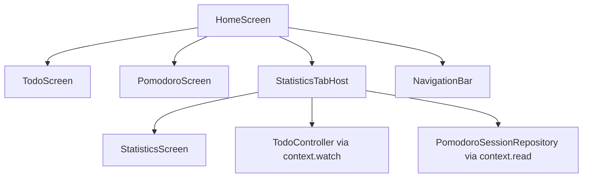
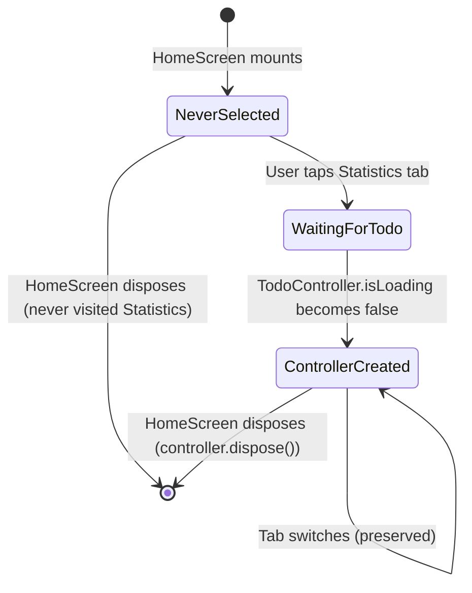

# Design Document: Home & Main Navigation

## Overview

The Home feature introduces an application shell (`HomeScreen`) that unifies the three existing features — Todo, Pomodoro, and Statistics — under a single Material 3 `NavigationBar`. The shell is a presentation-only feature: it has no domain or data layers. It uses `IndexedStack` to preserve widget state across tab switches and a lazy `StatisticsTabHost` to defer `StatisticsController` creation until the user actually visits the Statistics tab and `TodoController` has finished loading.

The current routing maps `/` directly to `_StatisticsRoute`. After this feature, `/` will map to `HomeScreen`, while direct routes (`/todo`, `/pomodoro`, `/statistics`) remain available for standalone access without the shell.

## Architecture

### Feature Placement

```
lib/features/home/
└── presentation/
    ├── screens/
    │   └── home_screen.dart        # Shell: NavigationBar + IndexedStack
    └── widgets/
        └── statistics_tab_host.dart # Lazy StatisticsController lifecycle
```

No `domain/` or `data/` layers — this feature only orchestrates existing presentation layers.

### Dependency Graph



HomeScreen imports only from:
- `lib/app/` (router constants)
- `lib/features/todo/presentation/screens/`
- `lib/features/pomodoro/presentation/screens/`
- `lib/features/statistics/presentation/` (screens + controllers)
- `lib/features/pomodoro/domain/repositories/` (PomodoroSessionRepository — exposed via Provider at app level)
- `lib/shared/`

### Provider Tree (unchanged)

```
MultiProvider (app.dart)
├── Provider<PomodoroSessionRepository>
├── ChangeNotifierProvider<TodoController>
└── ChangeNotifierProxyProvider<TodoController, PomodoroController>
    │
    └── MaterialApp
        └── Navigator
            └── HomeScreen (route '/')
                ├── TodoScreen (reads TodoController from tree)
                ├── PomodoroScreen (reads PomodoroController from tree)
                └── StatisticsTabHost
                    └── ChangeNotifierProvider<StatisticsController>.value
                        └── StatisticsScreen
```

No new providers are added at the app level. `StatisticsController` is provided locally by `StatisticsTabHost`.

## Components and Interfaces

### HomeScreen (`home_screen.dart`)

A `StatefulWidget` managing a single `_selectedIndex` integer (0–2).

**State fields:**
- `int _selectedIndex = 0` — currently active tab
- `bool _hasSelectedStatistics = false` — tracks whether Statistics tab has ever been selected (for lazy loading)

**Build structure:**
```dart
Scaffold(
  // No appBar — each tab has its own
  body: IndexedStack(
    index: _selectedIndex,
    children: [
      const TodoScreen(),
      const PomodoroScreen(),
      _hasSelectedStatistics
          ? const StatisticsTabHost()
          : const SizedBox.shrink(), // Placeholder until first selection
    ],
  ),
  bottomNavigationBar: NavigationBar(
    selectedIndex: _selectedIndex,
    onDestinationSelected: _onDestinationSelected,
    destinations: _destinations,
  ),
)
```

**Tab switch logic:**
```dart
void _onDestinationSelected(int index) {
  if (index == _selectedIndex) return; // No-op on same tab
  setState(() {
    _selectedIndex = index;
    if (index == 2 && !_hasSelectedStatistics) {
      _hasSelectedStatistics = true;
    }
  });
}
```

**Destination configuration** — defined as a `static const` list:
```dart
static const _destinations = [
  NavigationDestination(
    icon: Icon(Icons.checklist_outlined),
    selectedIcon: Icon(Icons.checklist),
    label: 'Todo',
  ),
  NavigationDestination(
    icon: Icon(Icons.timer_outlined),
    selectedIcon: Icon(Icons.timer),
    label: 'Pomodoro',
  ),
  NavigationDestination(
    icon: Icon(Icons.bar_chart_outlined),
    selectedIcon: Icon(Icons.bar_chart),
    label: 'Statistics',
  ),
];
```

### StatisticsTabHost (`statistics_tab_host.dart`)

A `StatefulWidget` responsible for:
1. Waiting until `TodoController.isLoading` becomes `false`
2. Creating a single `StatisticsController` instance
3. Providing it to the subtree via `ChangeNotifierProvider.value`
4. Disposing it when `HomeScreen` unmounts

**State fields:**
- `StatisticsController? _controller`

**Build logic:**
```dart
@override
Widget build(BuildContext context) {
  final todoController = context.watch<TodoController>();

  if (_controller == null && todoController.isLoading) {
    return Scaffold(
      appBar: AppBar(title: const Text('Statistics')),
      body: const Center(child: CircularProgressIndicator()),
    );
  }

  _controller ??= _createController(context);

  return ChangeNotifierProvider<StatisticsController>.value(
    value: _controller!,
    child: const StatisticsScreen(),
  );
}
```

**Controller creation** mirrors the existing `_StatisticsRoute._createController()`:
- Reads `PomodoroSessionRepository` from the Provider tree
- Instantiates use cases (CalculateDateRange, GetSessionsByDateRange, CalculateSummary, GroupByDay, GroupByTask, GroupByCategory)
- Constructs `StatisticsController` with a `taskCategoryMappingProvider` callback that captures `context` and reads `TodoController` at call time
- Calls `..init()`

**Dispose:**
```dart
@override
void dispose() {
  _controller?.dispose();
  super.dispose();
}
```

### Routing Changes (`router.dart`)

The `onGenerateRoute` switch statement changes:

**Before:**
```dart
case Routes.home:
case Routes.statistics:
  return MaterialPageRoute<void>(
    builder: (_) => const _StatisticsRoute(),
    settings: settings,
  );
```

**After:**
```dart
case Routes.home:
  return MaterialPageRoute<void>(
    builder: (_) => const HomeScreen(),
    settings: settings,
  );

case Routes.statistics:
  return MaterialPageRoute<void>(
    builder: (_) => const _StatisticsRoute(),
    settings: settings,
  );
```

This separates the two cases. `_StatisticsRoute` remains for direct `/statistics` access (standalone, outside the shell). `HomeScreen` becomes the root route.

All other routes (`/todo`, `/pomodoro`, `/todo/task/new`, `/todo/task/:id/edit`, `/todo/categories`, `/todo/categories/new`) remain unchanged.

## Data Models

No new data models, entities, or Isar collections are introduced. The Home feature is presentation-only and depends entirely on existing controllers and their state.

**Rationale:** The HomeScreen's only mutable state is a tab index integer. All domain state (tasks, timer, statistics) is already managed by existing controllers provided at the app level.

## Integration Points

### How HomeScreen integrates with existing features

| Concern | Integration mechanism |
|---|---|
| TodoScreen rendering | Direct `const TodoScreen()` in IndexedStack children |
| PomodoroScreen rendering | Direct `const PomodoroScreen()` in IndexedStack children |
| StatisticsScreen rendering | Via `StatisticsTabHost` which creates the provider |
| TodoController access | Inherited from app-level `ChangeNotifierProvider` |
| PomodoroController access | Inherited from app-level `ChangeNotifierProxyProvider` |
| PomodoroSessionRepository | Inherited from app-level `Provider<PomodoroSessionRepository>` |
| Navigation to sub-routes | Feature screens use `Navigator.of(context).pushNamed(...)` on the root navigator |

### Impact on existing screens

Existing screens (`TodoScreen`, `PomodoroScreen`, `StatisticsScreen`) require **zero modifications**. They each have their own `Scaffold` with `AppBar`, and they already read their controllers from the ancestor Provider tree. Placing them inside `IndexedStack` does not change their contract.

## Statistics Lifecycle Strategy

### Problem

`StatisticsController` requires `TodoController` to have finished loading before it can build the task-to-category mapping. Additionally, instantiating the controller and its use-case graph eagerly at app startup is wasteful if the user never visits the Statistics tab.

### Solution: Two-Phase Lazy Creation



**Phase 1: Never Selected**
- `_hasSelectedStatistics = false`
- IndexedStack slot 2 renders `SizedBox.shrink()` — zero cost
- No `StatisticsController` exists

**Phase 2: Waiting for TodoController**
- User taps Statistics → `_hasSelectedStatistics = true`
- `StatisticsTabHost` builds and watches `TodoController`
- If `todoController.isLoading == true`: shows loading scaffold
- Once `isLoading` becomes `false`: creates controller (Phase 3)

**Phase 3: Controller Created**
- `_controller` assigned once
- Provided via `ChangeNotifierProvider.value`
- Survives all subsequent tab switches (IndexedStack keeps it alive)
- Disposed only when HomeScreen itself disposes

### taskCategoryMappingProvider callback

```dart
taskCategoryMappingProvider: () {
  final todoCtrl = context.read<TodoController>();
  final categories = todoCtrl.categories;
  final categoryMap = <int, String>{
    for (final cat in categories) cat.id: cat.name,
  };
  return List<StatisticsTaskCategoryOption>.unmodifiable(
    todoCtrl.allTasks.map(
      (task) => StatisticsTaskCategoryOption(
        taskId: task.id,
        categoryId: task.categoryId,
        categoryName: task.categoryId != null
            ? categoryMap[task.categoryId]
            : null,
      ),
    ),
  );
},
```

The callback captures the `BuildContext` of `StatisticsTabHost` (which sits below the app-level MultiProvider) and reads `TodoController` at invocation time — meaning each statistics data load gets the freshest task/category mapping.

## Nested Scaffold Implications

### Layout stack

```
HomeScreen Scaffold (no appBar, has bottomNavigationBar)
└── IndexedStack
    ├── TodoScreen Scaffold (has appBar, has FAB)
    ├── PomodoroScreen Scaffold (has appBar)
    └── StatisticsTabHost
        └── StatisticsScreen Scaffold (has appBar, has RefreshIndicator)
```

### Consequences

| Widget | Behavior with nested Scaffolds |
|---|---|
| **AppBar** | Each tab's AppBar renders inside its own Scaffold. No double-AppBar risk because HomeScreen omits `appBar`. |
| **FAB** | `TodoScreen.floatingActionButton` renders within its Scaffold's body bounds, above the NavigationBar. The inner Scaffold does not know about the outer NavigationBar, so FAB positioning is correct by default (the inner Scaffold's available space already excludes the NavigationBar height because IndexedStack is the `body` of the outer Scaffold). |
| **SnackBar** | `ScaffoldMessenger.of(context)` inside a tab screen resolves to the **inner** Scaffold's ScaffoldMessenger (the nearest ancestor). SnackBars display within the tab area, scoped correctly. |
| **RefreshIndicator** | Operates within the inner Scaffold's body scrollable. Unaffected by nesting. |

### SafeArea

The outer `HomeScreen` Scaffold handles the system chrome (status bar, navigation bar insets). Inner Scaffolds may apply their own SafeArea for body content. Since the inner Scaffolds are within the `body` of the outer Scaffold (which already accounts for `bottomNavigationBar`), no double-inset occurs.

## Router Changes

### Before

| Route | Screen |
|---|---|
| `/` | `_StatisticsRoute` |
| `/statistics` | `_StatisticsRoute` |
| `/todo` | `TodoScreen` |
| `/pomodoro` | `PomodoroScreen` |

### After

| Route | Screen |
|---|---|
| `/` | `HomeScreen` (new) |
| `/statistics` | `_StatisticsRoute` (unchanged, standalone) |
| `/todo` | `TodoScreen` (unchanged, standalone) |
| `/pomodoro` | `PomodoroScreen` (unchanged, standalone) |

All task/category sub-routes remain identical.

### Back button behavior

- Tab switches use `setState` — no Navigator pushes. The Navigator stack stays at depth 1 while on HomeScreen.
- Sub-routes (`/todo/task/new`, etc.) push onto the root Navigator. Back pops to HomeScreen.
- Android system back on HomeScreen exits the app (default `MaterialApp` behavior when the stack has one entry).

## Correctness Properties

*A property is a characteristic or behavior that should hold true across all valid executions of a system — essentially, a formal statement about what the system should do. Properties serve as the bridge between human-readable specifications and machine-verifiable correctness guarantees.*

### Property 1: Tab selection displays corresponding screen

*For any* destination index `i` in `{0, 1, 2}`, when the user taps destination `i`, the `IndexedStack` shall render the child at index `i` as the visible widget, and the `NavigationBar.selectedIndex` shall equal `i`.

**Validates: Requirements 1.3, 9.2**

### Property 2: State preservation across tab switches

*For any* sequence of tab selections within a single `HomeScreen` lifecycle, returning to a previously visited tab shall find its widget subtree in the same state as when it was left (scroll position, form input, controller state), because the `IndexedStack` keeps all children built and mounted.

**Validates: Requirements 1.4, 3.1, 3.2, 3.3, 3.4**

### Property 3: PomodoroController identity preservation

*For any* number of tab switches within a single `HomeScreen` lifecycle, the `PomodoroController` instance obtained via `context.read<PomodoroController>()` from within the `PomodoroScreen` subtree shall be the identical (`identical()`) object on every access — no recreation, no disposal, no state mutation caused by tab switching.

**Validates: Requirements 4.2, 4.3, 4.5**

### Property 4: StatisticsController single creation

*For any* `HomeScreen` lifecycle, the number of `StatisticsController` instances created by `StatisticsTabHost` shall be either 0 (if the Statistics tab was never selected) or exactly 1 (if it was selected at least once). No additional instances shall be created regardless of how many times the user switches to and from the Statistics tab.

**Validates: Requirements 5.1, 5.4, 5.7**

### Property 5: Navigator stack invariant

*For any* sequence of tab selections (tapping NavigationBar destinations) within `HomeScreen`, the root Navigator's history stack depth shall remain exactly 1, with no entries pushed or popped as a result of tab switches.

**Validates: Requirements 7.1, 7.4**

## Error Handling

### Tab-level isolation

Each tab manages its own error state independently:

| Tab | Error handling |
|---|---|
| **Todo** | `TodoScreen` shows SnackBar with "Reload" action via its own `ScaffoldMessenger` |
| **Pomodoro** | `PomodoroScreen` shows SnackBar with "Retry" action for persistence errors |
| **Statistics** | `StatisticsScreen` shows inline error message + "Retry" `FilledButton` |

### HomeScreen-level error boundary

If a tab's widget tree throws during build (uncaught exception), Flutter's `ErrorWidget` will render in that slot of the `IndexedStack`. The NavigationBar and other tabs remain functional. To provide a better UX, each tab child in the IndexedStack can be wrapped in a builder that catches errors:

```dart
Widget _buildErrorBoundary(Widget child) {
  return Builder(
    builder: (context) {
      try {
        return child;
      } catch (_) {
        return const Center(child: Text('Something went wrong.'));
      }
    },
  );
}
```

However, since Flutter's build errors are already caught by the framework and `ErrorWidget` is displayed, and the requirements specify showing an error message (Requirement 1.9), wrapping with a custom `ErrorWidget.builder` at the app level or within each IndexedStack slot is the appropriate mechanism. The simplest approach: rely on Flutter's default `ErrorWidget` behavior (red error screen in debug, gray box in release) and customize `ErrorWidget.builder` in `main.dart` to show a user-friendly message.

### StatisticsTabHost loading gate

If `TodoController` is in an error state (not loading, but has `errorMessage`), `StatisticsTabHost` can still attempt to create `StatisticsController` because tasks may be partially loaded. The mapping callback will return whatever data is available at call time.

## Testing Strategy

### Unit Tests

- **HomeScreen widget tests**: Verify initial state (Todo tab selected), destination tap changes visible child, same-tab tap is no-op, NavigationBar has 3 destinations with correct icons/labels.
- **StatisticsTabHost widget tests**: Verify loading state while TodoController loads, controller creation after load completes, no creation if never selected, single instance across rebuilds, disposal on unmount.
- **Router tests**: Verify `/` maps to HomeScreen, `/statistics` maps to `_StatisticsRoute`, existing routes unchanged.
- **Accessibility tests**: Verify semantic labels on destinations, touch target sizes.

### Property-Based Tests (via `fast_check`)

Each correctness property maps to one property-based test:

| Property | Generator strategy | Assertion |
|---|---|---|
| P1: Tab selection | Generate random sequences of destination indices (0–2) | After each tap, `IndexedStack.index == tapped index` |
| P2: State preservation | Generate random tab switch sequences, inject identifiable state into each tab | After returning to a tab, verify state marker is unchanged |
| P3: Pomodoro identity | Generate random tab switch sequences | `identical(controller1, controller2)` across all reads |
| P4: Statistics single creation | Generate random tab switch sequences (some including index 2, some not) | Count controller creations ≤ 1 |
| P5: Navigator stack | Generate random tab switch sequences | `Navigator.of(context).canPop() == false` after each switch |

**Configuration**: Minimum 100 iterations per property test.
**Tag format**: `Feature: home-and-main-navigation, Property N: <description>`

### Integration Tests

- Full app boot → verify HomeScreen renders with NavigationBar
- Navigate to sub-route (`/todo/task/new`) → back → verify HomeScreen with Todo tab visible
- Timer running → switch tabs → return → verify timer state matches

## Open Questions

| # | Question | Recommendation |
|---|---|---|
| 1 | Should the Statistics tab placeholder (`SizedBox.shrink()`) show a minimal scaffold with AppBar to prevent layout jump when first selected? | **Yes** — show a Scaffold with "Statistics" AppBar and empty body. This prevents a visual jump and keeps the NavigationBar consistent. However, since IndexedStack only shows one child at a time, the placeholder is never visible to the user until they tap Statistics, at which point `StatisticsTabHost` immediately takes over. So `SizedBox.shrink()` is sufficient. |
| 2 | Should error boundary be a custom widget or rely on Flutter's `ErrorWidget`? | Rely on Flutter's default for v1.0. A custom error boundary adds complexity without clear benefit since feature screens already handle their own errors gracefully. |
| 3 | Should the `_StatisticsRoute` be extracted to a shared location since `StatisticsTabHost` duplicates its logic? | The two share the same controller-creation logic. Extract a `createStatisticsController(BuildContext)` factory function into `lib/features/statistics/presentation/` and have both `_StatisticsRoute` and `StatisticsTabHost` call it. This avoids duplication. |
