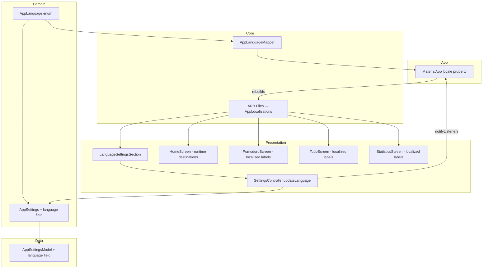

# Design Document — Localization and Language Settings

## Overview

This feature adds complete Spanish and English localization to Focus Flow using Flutter's official `gen_l10n` system with ARB resource files. A new `AppLanguage` domain enum is added to `AppSettings`, persisted via Isar, and exposed through the existing `SettingsController`. The `MaterialApp` locale property is driven by the existing `Consumer<SettingsController>` pattern, causing immediate full-app language switching without restart. All hardcoded user-facing strings across the four features (Todo, Pomodoro, Statistics, Settings), navigation labels, and shared widgets are replaced with references to the generated `AppLocalizations` class. Spanish (Latin American, neutral) is the template ARB and the default language.

## Architecture

```
┌──────────────────────────────────────────────────────────────────┐
│ main.dart                                                        │
│  openIsar() → IsarSettingsRepository → SettingsController        │
│  await settingsController.init()  ← language loaded before frame │
│  runApp(FocusFlowApp(isar, settingsController))                  │
└──────────────────────────────────────────────────────────────────┘
         │
         ▼
┌──────────────────────────────────────────────────────────────────┐
│ FocusFlowApp (app.dart)                                          │
│  Consumer<SettingsController>                                     │
│  MaterialApp                                                     │
│   ├─ locale: AppLanguageMapper.toLocale(settings.language)       │
│   ├─ localizationsDelegates: AppLocalizations.localizationsDelegates│
│   ├─ supportedLocales: AppLocalizations.supportedLocales         │
│   ├─ themeMode / theme / darkTheme (unchanged)                   │
│   └─ title: 'Focus Flow' (unchanged, not localized)             │
└──────────────────────────────────────────────────────────────────┘
         │
         ▼
┌──────────────────────────────────────────────────────────────────┐
│ Widget tree                                                      │
│  AppLocalizations.of(context)! → localized strings everywhere    │
└──────────────────────────────────────────────────────────────────┘
```

### Flutter Localization Setup

**pubspec.yaml changes:**
- Add `flutter_localizations` SDK dependency.
- Add `intl: any` dependency (implicitly pinned by flutter_localizations).
- Add `generate: true` under the `flutter:` section.

**l10n.yaml** (project root):
```yaml
arb-dir: lib/l10n
template-arb-file: app_es.arb
output-localization-file: app_localizations.dart
output-class: AppLocalizations
```

**ARB files:**
- `lib/l10n/app_es.arb` — Spanish template with `@` metadata descriptions.
- `lib/l10n/app_en.arb` — English translations.

The generated `AppLocalizations` class is auto-imported from `package:flutter_gen/gen_l10n/app_localizations.dart`.

### AppLanguage Enum Placement

```
lib/features/settings/domain/entities/app_language.dart
```

```dart
/// Supported application languages.
///
/// Pure Dart — no Flutter imports.
enum AppLanguage {
  spanish,  // index 0 — default
  english,  // index 1
}
```

### AppLanguageMapper

```
lib/core/localization/app_language_mapper.dart
```

```dart
import 'dart:ui';
import '../../features/settings/domain/entities/app_language.dart';

/// Maps [AppLanguage] domain enum to Flutter [Locale].
abstract final class AppLanguageMapper {
  static Locale toLocale(AppLanguage language) => switch (language) {
    AppLanguage.spanish => const Locale('es'),
    AppLanguage.english => const Locale('en'),
  };
}
```

Uses `dart:ui` `Locale` (not `package:flutter/material.dart`) to keep the mapper minimal. This follows the same structural pattern as `AppThemeModeMapper` but uses a static helper class rather than an extension because `Locale` is the target type, not a conversion on the enum itself. Either approach is acceptable; a static class avoids importing flutter material in `core/localization/`.

### AppSettings and AppSettingsModel Changes

**AppSettings** (`lib/features/settings/domain/entities/app_settings.dart`):
- Add `AppLanguage language` field with default `AppLanguage.spanish`.
- Add `language` to `copyWith`, `==`, and `hashCode`.

**AppSettingsModel** (`lib/features/settings/data/models/app_settings_model.dart`):
- Add `@enumerated AppLanguage language = AppLanguage.spanish` field.
- Update `toEntity()` and `fromEntity()` to include the language field.
- Unknown enum index falls back to `AppLanguage.spanish` (Isar stores enum as int index; if an index beyond known values is read, Isar's `@enumerated` defaults to index 0, which is `spanish`).

### SettingsController updateLanguage Method

```dart
/// Updates the application language.
///
/// Returns `true` on successful persist, `false` if already saving
/// or persistence fails.
Future<bool> updateLanguage(AppLanguage language) async {
  return _applyChange(
    _settings.copyWith(language: language),
    settingName: 'language',
  );
}
```

This follows the identical optimistic-update-with-rollback pattern used by `updateThemeMode` and `updateColorPalette`. The `_applyChange` helper handles: no-op check, `_isSaving` guard, optimistic notify, persist, rollback on failure.

### MaterialApp Locale Integration

In `app.dart`, inside the existing `Consumer<SettingsController>` builder:

```dart
MaterialApp(
  locale: AppLanguageMapper.toLocale(settings.settings.language),
  localizationsDelegates: AppLocalizations.localizationsDelegates,
  supportedLocales: AppLocalizations.supportedLocales,
  // ... existing themeMode, theme, darkTheme, title, routes
)
```

Since `SettingsController.notifyListeners()` triggers the `Consumer` rebuild, changing language causes `MaterialApp` to rebuild with the new `locale` in the same frame. Flutter's localization system propagates the new `AppLocalizations` instance down the widget tree automatically.

### HomeScreen: Runtime NavigationDestination List

Replace the current `static const _destinations` with a method in `build()`:

```dart
@override
Widget build(BuildContext context) {
  final l10n = AppLocalizations.of(context)!;

  final destinations = <NavigationDestination>[
    NavigationDestination(
      icon: const Icon(Icons.checklist_outlined),
      selectedIcon: const Icon(Icons.checklist),
      label: l10n.navigationTodo,
    ),
    NavigationDestination(
      icon: const Icon(Icons.timer_outlined),
      selectedIcon: const Icon(Icons.timer),
      label: l10n.navigationPomodoro,
    ),
    NavigationDestination(
      icon: const Icon(Icons.bar_chart_outlined),
      selectedIcon: const Icon(Icons.bar_chart),
      label: l10n.navigationStatistics,
    ),
    NavigationDestination(
      icon: const Icon(Icons.settings_outlined),
      selectedIcon: const Icon(Icons.settings),
      label: l10n.navigationSettings,
    ),
  ];

  return Scaffold(
    body: IndexedStack(
      index: _selectedIndex,
      children: [ /* unchanged */ ],
    ),
    bottomNavigationBar: NavigationBar(
      selectedIndex: _selectedIndex,
      onDestinationSelected: _onDestinationSelected,
      destinations: destinations,
    ),
  );
}
```

The `_selectedIndex` and `IndexedStack` state are preserved across rebuilds because they live in `_HomeScreenState`.

### Duration Formatter Localization Approach

The `formatDuration` function currently hardcodes `"min"` and `"h"`. Since both Spanish and English share these abbreviations, the simplest approach is to use ARB entries with placeholders:

**ARB entries:**
```json
"durationMinutes": "{minutes} min",
"@durationMinutes": { "placeholders": { "minutes": { "type": "int" } } },
"durationHoursMinutes": "{hours} h {minutes} min",
"@durationHoursMinutes": { "placeholders": { "hours": { "type": "int" }, "minutes": { "type": "int" } } }
```

**New signature:**
```dart
String formatDuration(int totalSeconds, AppLocalizations l10n) {
  if (totalSeconds < 3600) {
    final minutes = totalSeconds ~/ 60;
    return l10n.durationMinutes(minutes);
  }
  final hours = totalSeconds ~/ 3600;
  final minutes = (totalSeconds % 3600) ~/ 60;
  return l10n.durationHoursMinutes(hours, minutes);
}
```

Callers pass `AppLocalizations.of(context)!` — this keeps the formatter a pure function (testable with a mock `AppLocalizations`). An alternative would be to accept raw unit strings, but using `AppLocalizations` directly is cleaner and future-proofs for languages where the pattern differs.

### Daily Activity Chart Weekday Localization

Replace the hardcoded `weekdays` array with locale-derived labels using `intl` `DateFormat`:

```dart
import 'package:intl/intl.dart';

String _shortDayLabel(DateTime date, String locale) {
  return DateFormat.E(locale).format(date);
}
```

The `locale` string (`'es'` or `'en'`) is derived from `Localizations.localeOf(context).languageCode` in the widget's `build()` method and passed into the bar widget.

### Enum Label Localization Pattern

Domain enums (`Priority`, `TaskStatus`, `SortCriterion`, `TimerMode`, `AppThemeMode`, `AppColorPalette`) remain pure Dart. Presentation-layer helper functions receive `AppLocalizations` and return the localized label:

```dart
// lib/features/pomodoro/presentation/utils/timer_mode_labels.dart
String timerModeLabel(TimerMode mode, AppLocalizations l10n) => switch (mode) {
  TimerMode.focus => l10n.pomodoroModeFocus,
  TimerMode.shortBreak => l10n.pomodoroModeShortBreak,
  TimerMode.longBreak => l10n.pomodoroModeLongBreak,
};
```

This keeps domain enums free of Flutter imports while providing localized display names wherever needed. Each feature owns its own label helpers under `presentation/utils/`.

### Error Message Localization Strategy

Controllers keep their existing English error messages internally (e.g., `'Could not save $settingName. Please try again.'`). The presentation layer maps known error patterns to localized strings:

**Approach:** The `SettingsScreen` (and other screens showing SnackBar errors) intercepts the `saveErrorMessage` from the controller and maps it to a localized string. Since the controller exposes the `settingName` that failed, the screen can construct the localized message:

```dart
// In SettingsScreen when showing error SnackBar:
final l10n = AppLocalizations.of(context)!;
final localizedError = l10n.settingsSaveError(settingName);
```

Where `settingsSaveError` is an ARB entry with placeholder: `"No se pudo guardar {settingName}. Intente de nuevo."`.

To enable this, the controller exposes the raw `settingName` key (not the full English sentence) as a separate getter when a save error occurs. This is a minor refactor: add a `String? get failedSettingName` alongside the existing `saveErrorMessage`. The presentation layer uses `failedSettingName` to construct localized error text.

**Alternative considered:** Having the controller expose error codes instead of strings. This is cleaner architecturally but requires more refactoring of the existing pattern. The `failedSettingName` approach is minimal and compatible with the existing optimistic-update flow.

## Components and Interfaces

### Files to Create

| Path | Purpose |
|------|---------|
| `l10n.yaml` | Flutter l10n generator configuration |
| `lib/l10n/app_es.arb` | Spanish template ARB (all keys with `@` descriptions) |
| `lib/l10n/app_en.arb` | English translations ARB |
| `lib/features/settings/domain/entities/app_language.dart` | Pure Dart `AppLanguage` enum |
| `lib/core/localization/app_language_mapper.dart` | Maps AppLanguage → Locale |
| `lib/features/settings/presentation/widgets/language_settings_section.dart` | Language selector UI section |
| `lib/features/pomodoro/presentation/utils/timer_mode_labels.dart` | Localized TimerMode labels |
| `lib/features/todo/presentation/utils/todo_labels.dart` | Localized Priority, TaskStatus, SortCriterion labels |
| `lib/features/statistics/presentation/utils/statistics_labels.dart` | Localized statistics period labels |
| `lib/features/settings/presentation/utils/settings_labels.dart` | Localized theme mode, palette labels |

### Files to Modify

| Path | Change |
|------|--------|
| `pubspec.yaml` | Add `flutter_localizations`, `intl`, `generate: true` |
| `lib/features/settings/domain/entities/app_settings.dart` | Add `language` field |
| `lib/features/settings/data/models/app_settings_model.dart` | Add `language` Isar field, update `toEntity`/`fromEntity` |
| `lib/features/settings/presentation/controllers/settings_controller.dart` | Add `updateLanguage`, expose `failedSettingName` |
| `lib/app/app.dart` | Add `locale`, `localizationsDelegates`, `supportedLocales` to MaterialApp |
| `lib/features/home/presentation/screens/home_screen.dart` | Remove `static const _destinations`, build list at runtime |
| `lib/features/settings/presentation/screens/settings_screen.dart` | Add `LanguageSettingsSection`, localize title and error strings |
| `lib/features/settings/presentation/widgets/appearance_settings_section.dart` | Replace hardcoded labels with `l10n.*` calls |
| `lib/features/settings/presentation/widgets/pomodoro_settings_section.dart` | Replace hardcoded labels with `l10n.*` calls |
| `lib/features/settings/presentation/widgets/sound_settings_section.dart` | Replace hardcoded labels with `l10n.*` calls |
| `lib/features/pomodoro/presentation/screens/pomodoro_screen.dart` | Replace hardcoded mode/status labels with `l10n.*` |
| `lib/features/pomodoro/presentation/widgets/timer_controls.dart` | Replace hardcoded button labels with `l10n.*` |
| `lib/features/todo/presentation/screens/todo_screen.dart` | Replace hardcoded strings with `l10n.*` |
| `lib/features/todo/presentation/widgets/empty_state_widget.dart` | Accept localized strings or use `l10n` directly |
| `lib/features/todo/presentation/widgets/filter_bar.dart` | Replace filter labels with `l10n.*` |
| `lib/features/todo/presentation/widgets/sort_control.dart` | Replace sort labels with `l10n.*` |
| `lib/features/statistics/presentation/widgets/summary_cards_row.dart` | Replace metric labels with `l10n.*` |
| `lib/features/statistics/presentation/widgets/period_selector.dart` | Replace period labels with `l10n.*` |
| `lib/features/statistics/presentation/widgets/daily_activity_chart.dart` | Use locale-aware weekday labels |
| `lib/features/statistics/presentation/utils/duration_formatter.dart` | Accept `AppLocalizations` parameter |
| `lib/app/router.dart` | Localize "Not Found" / "Page not found" in `_NotFoundScreen` |
| `lib/shared/widgets/confirmation_dialog.dart` | No structural change (already accepts labels as params) |

### Component Interaction Diagram



## Data Models

### AppSettings Entity (Updated)

```
AppSettings (immutable, copyWith, equality)
├── focusDuration: Duration
├── shortBreakDuration: Duration
├── longBreakDuration: Duration
├── cyclesBeforeLongBreak: int
├── soundEnabled: bool
├── themeMode: AppThemeMode
├── colorPalette: AppColorPalette
└── language: AppLanguage          ← NEW
```

### AppSettingsModel Isar Schema (Updated)

```
AppSettingsModel
├── id: int (always 1)
├── focusDurationMinutes: int
├── shortBreakDurationMinutes: int
├── longBreakDurationMinutes: int
├── cyclesBeforeLongBreak: int
├── soundEnabled: bool
├── themeMode: int (enum index)
├── colorPalette: int (enum index)
└── language: int (enum index)     ← NEW (default: 0 = spanish)
```

### Migration Behavior

- **Existing records without language field:** Isar's `@enumerated` stores enums as integer indices. When a field is added to an existing collection, Isar initializes it with the Dart default value. Since `language` is declared with `= AppLanguage.spanish`, existing records resolve to Spanish on first read.
- **Unknown enum index (downgrade scenario):** If the stored index exceeds `AppLanguage.values.length - 1`, Isar's behavior is to return index 0 (`spanish`). This is safe.
- **Schema regeneration:** Adding the field requires running `dart run build_runner build` to regenerate `app_settings_model.g.dart`. The Isar schema version is unchanged (additive field change is non-breaking).

### ARB Key Naming Convention

Keys use descriptive camelCase prefixed by feature area:

| Prefix | Feature |
|--------|---------|
| `navigation*` | Bottom nav bar labels |
| `todo*` | Todo feature strings |
| `pomodoro*` | Pomodoro feature strings |
| `statistics*` | Statistics feature strings |
| `settings*` | Settings feature strings |
| `shared*` | Cross-feature strings (retry, cancel, delete) |
| `duration*` | Duration formatting templates |
| `error*` | Error messages (not found, etc.) |

## Correctness Properties

*A property is a characteristic or behavior that should hold true across all valid executions of a system — essentially, a formal statement about what the system should do. Properties serve as the bridge between human-readable specifications and machine-verifiable correctness guarantees.*

### Property 1: Language setting round-trip persistence

*For any* valid `AppLanguage` value, saving an `AppSettings` with that language via `SaveSettingsUseCase` and then loading it via `GetSettingsUseCase` SHALL produce an `AppSettings` whose `language` field equals the original value.

**Validates: Requirements 3.1, 3.2, 3.3, 4.1, 4.4**

### Property 2: Language change preserves all other settings

*For any* valid `AppSettings` instance and *for any* `AppLanguage` value, calling `copyWith(language: newLanguage)` SHALL produce a new `AppSettings` where all non-language fields (focusDuration, shortBreakDuration, longBreakDuration, cyclesBeforeLongBreak, soundEnabled, themeMode, colorPalette) are identical to the original.

**Validates: Requirements 5.4, 7.3, 7.5, 21.1, 21.2, 21.3, 21.4**

### Property 3: AppLanguageMapper bijectivity

*For any* `AppLanguage` value, `AppLanguageMapper.toLocale` SHALL produce a distinct `Locale` (no two AppLanguage values map to the same Locale), and the resulting locale's `languageCode` SHALL be a supported BCP 47 language tag (`'es'` or `'en'`).

**Validates: Requirements 1.6, 2.3**

### Property 4: Duration formatter locale consistency

*For any* non-negative integer `totalSeconds` and *for any* valid `AppLocalizations` instance (Spanish or English), calling `formatDuration(totalSeconds, l10n)` SHALL produce a non-empty string containing the correct numeric values (hours and minutes derived from totalSeconds), and the result SHALL NOT contain raw placeholder tokens like `{minutes}` or `{hours}`.

**Validates: Requirements 16.1, 16.2, 16.3, 16.4**

### Property 5: updateLanguage rollback on failure

*For any* `AppSettings` with a successfully persisted language value, if a subsequent `updateLanguage` call fails to persist, the controller's `settings.language` SHALL revert to the last successfully persisted language value.

**Validates: Requirements 5.3**

### Property 6: Language change does not reset isSaving guard

*For any* in-progress save operation (`isSaving == true`), calling `updateLanguage` with any `AppLanguage` value SHALL return `false` without modifying the in-memory settings or triggering a second persist attempt.

**Validates: Requirements 5.5**

## Error Handling

### Language Load Errors

| Scenario | Controller Behavior | UI Behavior |
|----------|-------------------|-------------|
| Record exists without language field (migration) | `language` defaults to `AppLanguage.spanish` via Isar default | Renders normally in Spanish |
| Isar read exception (same as general settings load failure) | status = `error`, exposes errorMessage | Shows error + Retry button |
| Unknown enum index stored | Falls back to `AppLanguage.spanish` (index 0) | Renders normally in Spanish |

### Language Save Errors

| Scenario | Controller Behavior | UI Behavior |
|----------|-------------------|-------------|
| Isar write exception | Reverts language to last persisted value, sets `saveErrorMessage` | SnackBar with localized error, language selector reverts |
| Concurrent save attempt (`isSaving` guard) | Returns `false`, no state change | Language selector remains on current selection |

### Invariants During Language Change

- The `PomodoroController` timer state (remainingDuration, status, cycleCount, selectedTask) is never modified.
- The `TodoController` state (tasks, filters, sort) is never modified.
- The `IndexedStack` selected index is preserved.
- Scroll positions within each tab are preserved.
- User-generated content (task titles, notes, category names) is never modified.

## Testing Strategy

### Unit Tests

**AppSettings:**
- `copyWith(language:)` produces correct result with other fields unchanged.
- Equality includes `language` field.
- Default construction has `language == AppLanguage.spanish`.

**AppSettingsModel:**
- `toEntity()` converts language field correctly.
- `fromEntity()` stores language field correctly.
- Round-trip `fromEntity(entity).toEntity() == entity` including language.

**AppLanguageMapper:**
- `spanish` maps to `Locale('es')`.
- `english` maps to `Locale('en')`.
- All values produce distinct locales.

**SettingsController.updateLanguage:**
- Successful persist updates `settings.language` and returns `true`.
- Failed persist reverts to previous language and returns `false`.
- Rejected while `isSaving` returns `false` without changing state.
- Language change does not alter other settings fields.

**Duration formatter:**
- Produces correct output for 0 seconds.
- Produces correct output for values below 3600.
- Produces correct output for values at/above 3600.
- Works identically with both locale variants.

### Property-Based Tests

Library: `fast_check` (Dart property-based testing library)

Each test runs a minimum of 100 iterations.

| Property | Generator Strategy |
|----------|-------------------|
| P1: Language round-trip | Generate random valid AppSettings (all fields randomized including language), persist, load, compare |
| P2: Language change preserves other settings | Generate random AppSettings + random AppLanguage, apply copyWith, verify other fields unchanged |
| P3: Mapper bijectivity | Exhaustive (only 2 values) — verify distinct locales with valid language codes |
| P4: Duration formatter consistency | Generate random non-negative int (0 to 100000), call formatter with each locale variant, verify non-empty, no raw placeholders, correct numeric content |
| P5: Rollback on failure | Generate random initial language + random target language, mock save to throw, verify revert |
| P6: isSaving guard | Generate random language, set isSaving=true, call updateLanguage, verify returns false and settings unchanged |

### Widget Tests

- `LanguageSettingsSection` renders two options with correct labels.
- Selection change calls `updateLanguage` on controller.
- Disabled state when `isSaving` is true.
- Semantics labels present on both options.
- 48dp touch targets met.
- `HomeScreen` builds destinations with localized labels from AppLocalizations.
- Navigation tab labels update when locale changes (mock controller).
- Selected tab index preserved across locale change.
- Save error SnackBar displays localized message.

### Integration Tests

- Full startup: default language is Spanish, all strings are Spanish.
- Language switch to English: all visible strings update, timer state preserved.
- Language persisted across simulated restart.
- Duration formatter output matches expected format in both locales.
- Daily activity chart weekday labels match locale.

## Open Questions

1. **ARB key count estimation:** The full feature requires approximately 80–100 ARB keys across all features. The exact key list will be finalized during implementation when each screen is migrated. The ARB files will be built incrementally per task.

2. **intl package date formatting:** Using `DateFormat.E(locale)` for weekday abbreviations requires that `intl` date formatting data is initialized. Flutter's `flutter_localizations` dependency handles this automatically when `localizationsDelegates` includes `GlobalMaterialLocalizations.delegate`. No additional initialization code is needed.

3. **Empty state widget refactoring:** `EmptyStateWidget` currently has internal `_headlineForVariant` / `_messageForVariant` methods with hardcoded strings. Two options:
   - (a) Make the widget accept headline/message as parameters, with callers providing localized strings.
   - (b) Have the widget call `AppLocalizations.of(context)!` internally.
   
   **Decision:** Option (b) — the widget accesses `AppLocalizations.of(context)!` directly. This keeps callers simple and avoids passing many string parameters. The widget already has access to `BuildContext`.
