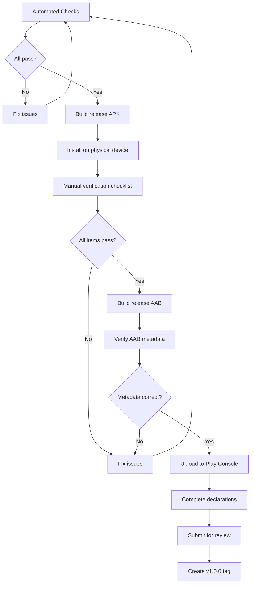

# Design Document — Release Preparation (Focus Flow 1.0.0)

## Overview

This design covers the complete preparation of Focus Flow 1.0.0 for Google Play Store submission. It is a configuration and documentation spec — no new product features are implemented. The work is organized into five streams: (1) repository changes to `build.gradle.kts`, manifests, and Dart code; (2) secret management for signing credentials kept outside Git; (3) documentation assets (privacy policy, store listing drafts, release notes); (4) a minimal in-app privacy policy link in Settings; and (5) verification checklists and Play Console workflow documentation.

The design preserves Flutter-managed defaults wherever possible, introduces the `url_launcher` package for the privacy link, and creates a `docs/` tree for all release-facing prose. All unresolved decisions (applicationId, developer email, privacy URL) are represented by clearly marked placeholders.

---

## Architecture

### How release preparation fits the existing project structure

```
focus_flow/
├── android/
│   ├── app/
│   │   ├── build.gradle.kts        ← signing config, SDK targets
│   │   └── src/main/
│   │       ├── AndroidManifest.xml  ← no changes needed (already correct)
│   │       └── kotlin/<package>/    ← relocate if applicationId confirmed
│   └── key.properties               ← created locally, gitignored
│
├── lib/
│   ├── core/
│   │   └── constants/
│   │       └── app_urls.dart        ← NEW: centralized URL constants
│   ├── features/
│   │   └── settings/
│   │       └── presentation/
│   │           └── widgets/
│   │               └── privacy_policy_section.dart  ← NEW widget
│   └── l10n/
│       ├── app_es.arb               ← add privacy-related strings
│       └── app_en.arb               ← add privacy-related strings
│
├── docs/                             ← NEW top-level directory
│   ├── privacy-policy.md            ← Spanish + English privacy policy
│   ├── store-listing/
│   │   ├── es-AR.md                 ← Spanish store listing draft
│   │   └── en-US.md                 ← English store listing draft
│   ├── release-notes/
│   │   └── 1.0.0.md                 ← Release notes
│   ├── checklists/
│   │   ├── verification-checklist.md    ← Manual QA checklist
│   │   ├── automated-checks.md         ← Pre-build automated checks
│   │   └── data-safety-audit.md        ← Dependency data audit
│   └── play-console/
│       └── upload-workflow.md        ← Step-by-step Play Console guide
│
└── pubspec.yaml                      ← add url_launcher dependency
```

### Design Principles

1. **Minimal code changes** — Only add the privacy policy section widget, URL constant, and localization strings. No existing logic is modified.
2. **Secrets never in Git** — Keystore and `key.properties` stay out of version control. The `android/.gitignore` already covers `key.properties`, `**/*.keystore`, and `**/*.jks`.
3. **Flutter-managed values preferred** — SDK targets and version info continue to use `flutter.compileSdkVersion`, `flutter.targetSdkVersion`, `flutter.versionCode`, `flutter.versionName`.
4. **Placeholders for unresolved decisions** — `[APPLICATION_ID]`, `[DEVELOPER_EMAIL]`, `[PRIVACY_POLICY_URL]` are used consistently across all documents until confirmed.
5. **Documentation as code** — All release documentation lives in `docs/` under version control for traceability.

---

## Components and Interfaces

### 1. Signing Configuration (`build.gradle.kts`)

**Current state:** Release build type uses `signingConfigs.getByName("debug")`.

**Target state:**

```kotlin
import java.util.Properties
import java.io.FileInputStream

plugins {
    id("com.android.application")
    id("dev.flutter.flutter-gradle-plugin")
}

val keystorePropertiesFile = rootProject.file("app/key.properties")
val keystoreProperties = Properties()

if (keystorePropertiesFile.exists()) {
    keystoreProperties.load(FileInputStream(keystorePropertiesFile))
} else {
    throw GradleException(
        "key.properties not found at ${keystorePropertiesFile.absolutePath}. " +
        "Create this file with storeFile, storePassword, keyAlias, keyPassword."
    )
}

android {
    namespace = "[APPLICATION_ID]"
    compileSdk = flutter.compileSdkVersion
    ndkVersion = flutter.ndkVersion

    signingConfigs {
        create("release") {
            storeFile = file(keystoreProperties["storeFile"] as String)
            storePassword = keystoreProperties["storePassword"] as String
            keyAlias = keystoreProperties["keyAlias"] as String
            keyPassword = keystoreProperties["keyPassword"] as String
        }
    }

    defaultConfig {
        applicationId = "[APPLICATION_ID]"
        minSdk = flutter.minSdkVersion
        targetSdk = flutter.targetSdkVersion
        versionCode = flutter.versionCode
        versionName = flutter.versionName
    }

    buildTypes {
        release {
            signingConfig = signingConfigs.getByName("release")
            isMinifyEnabled = true
            isShrinkResources = true
            proguardFiles(
                getDefaultProguardFile("proguard-android-optimize.txt"),
                "proguard-rules.pro"
            )
        }
    }
}
```

**Key decisions:**
- The `key.properties` path is relative to the `android/app/` directory (consistent with Flutter convention).
- Build **fails immediately** with a clear error if `key.properties` is missing — no fallback to debug signing.
- ProGuard/R8 is enabled for release (`isMinifyEnabled`, `isShrinkResources`). A `proguard-rules.pro` file is added for Flutter and Isar keep rules.
- `compileSdk` and `targetSdk` remain Flutter-managed. If the resolved value is <36 at build time, they will be overridden to `36` using a conditional check.

### 2. `key.properties` Template

```properties
storeFile=../keystores/upload-keystore.jks
storePassword=<YOUR_STORE_PASSWORD>
keyAlias=upload
keyPassword=<YOUR_KEY_PASSWORD>
```

This file is **never committed**. A `key.properties.example` with placeholder values is committed for developer reference.

### 3. Keystore Generation (Manual, Outside Git)

```bash
keytool -genkeypair -v \
  -keystore upload-keystore.jks \
  -keyalg RSA \
  -keysize 2048 \
  -validity 10000 \
  -alias upload
```

The keystore is stored in a secure location outside the repository (e.g., `~/.android/keystores/` or a secrets manager). The path in `key.properties` is relative or absolute depending on the developer's local setup.

### 4. ProGuard Rules (`android/app/proguard-rules.pro`)

```proguard
## Flutter
-keep class io.flutter.** { *; }
-keep class io.flutter.embedding.** { *; }

## Isar
-keep class dev.isar.** { *; }
-keepclassmembers class * {
    @dev.isar.isar.annotation.* <fields>;
}
```

### 5. SDK Target Verification

The current `build.gradle.kts` uses `flutter.compileSdkVersion` and `flutter.targetSdkVersion`. As of Flutter 3.22+, these resolve to SDK 35. For the Google Play requirement (API 36+ by Aug 31, 2026):

- **Strategy**: Check the Flutter-resolved value. If it's ≥36, keep the managed values. If <36, override explicitly.
- **Implementation**: Add a conditional in `build.gradle.kts`:

```kotlin
compileSdk = if (flutter.compileSdkVersion >= 36) flutter.compileSdkVersion else 36
// Same pattern for targetSdk
```

This ensures forward compatibility — once Flutter bumps its default past 36, the conditional becomes a no-op.

### 6. In-App Privacy Policy Widget

**File:** `lib/features/settings/presentation/widgets/privacy_policy_section.dart`

**Design:**
- A simple `ListTile` with a trailing external-link icon.
- On tap, launches the privacy policy URL via `url_launcher`.
- On failure, shows a `SnackBar` with a localized error message.
- Uses `AppUrls.privacyPolicy` from `lib/core/constants/app_urls.dart`.
- Does NOT introduce a new controller (requirement 8.6).

```dart
import 'package:flutter/material.dart';
import 'package:url_launcher/url_launcher.dart';

import '../../../../core/constants/app_urls.dart';
import '../../../../l10n/app_localizations.dart';

class PrivacyPolicySection extends StatelessWidget {
  const PrivacyPolicySection({super.key});

  @override
  Widget build(BuildContext context) {
    final l10n = AppLocalizations.of(context)!;

    return Column(
      crossAxisAlignment: CrossAxisAlignment.start,
      children: [
        Padding(
          padding: const EdgeInsets.symmetric(horizontal: 16, vertical: 8),
          child: Text(
            l10n.settingsSectionPrivacy,
            style: Theme.of(context).textTheme.titleMedium,
          ),
        ),
        ListTile(
          title: Text(l10n.settingsPrivacyPolicy),
          trailing: const Icon(Icons.open_in_new),
          onTap: () => _openPrivacyPolicy(context),
        ),
      ],
    );
  }

  Future<void> _openPrivacyPolicy(BuildContext context) async {
    final uri = Uri.parse(AppUrls.privacyPolicy);
    final l10n = AppLocalizations.of(context)!;

    if (!await launchUrl(uri, mode: LaunchMode.externalApplication)) {
      if (context.mounted) {
        ScaffoldMessenger.of(context)
          ..hideCurrentSnackBar()
          ..showSnackBar(
            SnackBar(content: Text(l10n.settingsPrivacyPolicyError)),
          );
      }
    }
  }
}
```

**Integration in `SettingsScreen`:**

The `_LoadedBody` widget adds `PrivacyPolicySection()` as the last item in the `ListView`:

```dart
class _LoadedBody extends StatelessWidget {
  const _LoadedBody();

  @override
  Widget build(BuildContext context) {
    return ListView(
      children: const [
        PomodoroSettingsSection(),
        AppearanceSettingsSection(),
        LanguageSettingsSection(),
        SoundSettingsSection(),
        PrivacyPolicySection(), // ← Added after Sound
      ],
    );
  }
}
```

### 7. URL Constants

**File:** `lib/core/constants/app_urls.dart`

```dart
/// Centralized external URL constants for the application.
///
/// All URLs that point to external resources are defined here
/// to avoid duplication and simplify maintenance.
abstract final class AppUrls {
  /// Privacy policy URL displayed in Settings and declared on Play Console.
  ///
  /// TODO(release): Replace with the actual public URL before release.
  static const String privacyPolicy = '[PRIVACY_POLICY_URL]';
}
```

### 8. Localization Additions

New keys added to `app_es.arb` and `app_en.arb`:

| Key | Spanish | English |
|---|---|---|
| `settingsSectionPrivacy` | `Privacidad` | `Privacy` |
| `settingsPrivacyPolicy` | `Política de privacidad` | `Privacy policy` |
| `settingsPrivacyPolicyError` | `No se pudo abrir la política de privacidad` | `Could not open privacy policy` |

### 9. `url_launcher` Integration

**pubspec.yaml addition:**

```yaml
dependencies:
  url_launcher: ^6.2.0
```

**AndroidManifest.xml `<queries>` addition:**

```xml
<queries>
    <!-- Existing -->
    <intent>
        <action android:name="android.intent.action.PROCESS_TEXT"/>
        <data android:mimeType="text/plain"/>
    </intent>
    <!-- For url_launcher -->
    <intent>
        <action android:name="android.intent.action.VIEW"/>
        <data android:scheme="https"/>
    </intent>
</queries>
```

### 10. Application Identity & MainActivity Path

**Current state:**
- `applicationId = "com.ncambe.focus_flow"` in `build.gradle.kts`
- `namespace = "com.ncambe.focus_flow"` in `build.gradle.kts`
- `MainActivity.kt` lives at `android/app/src/main/kotlin/com/example/focus_flow/` but declares `package com.ncambe.focus_flow`

**Design decision:**
- The applicationId is **unresolved** — it will be set to the user-confirmed value at implementation time.
- When confirmed, `MainActivity.kt` must be relocated to match the package path (e.g., `com/ncambe/focusflow/` for `com.ncambe.focusflow`).
- Until confirmed, the existing discrepancy (file path says `com/example/focus_flow`, package declaration says `com.ncambe.focus_flow`) is documented but not modified.

### 11. Manifest Permissions Audit

**Release manifest merge behavior:**
- `src/main/AndroidManifest.xml` — the only manifest merged for release builds. Contains no permission declarations.
- `src/debug/AndroidManifest.xml` — adds `INTERNET` permission. NOT merged into release.
- `src/profile/AndroidManifest.xml` — adds `INTERNET` permission. NOT merged into release.

**Dependency-contributed permissions:**
- `isar_flutter_libs` — none
- `path_provider` — none
- `provider` — none (pure Dart)
- `intl` — none (pure Dart)
- `cupertino_icons` — none (asset package)
- `url_launcher` — may contribute `QUERY_ALL_PACKAGES` or similar on older versions; the `<queries>` declaration in our manifest handles the modern approach without broad permissions.

If any dependency contributes an unexpected permission, it will be removed via:
```xml
<uses-permission android:name="android.permission.INTERNET" tools:node="remove"/>
```

---

## Data Models

This spec does not introduce new Isar collections or domain entities. The only data-level artifacts are:

### Document Files (Non-Code)

| File | Purpose | Format |
|---|---|---|
| `docs/privacy-policy.md` | Privacy policy (ES + EN) | Markdown with sections |
| `docs/store-listing/es-AR.md` | Spanish store listing draft | Markdown template |
| `docs/store-listing/en-US.md` | English store listing draft | Markdown template |
| `docs/release-notes/1.0.0.md` | v1.0.0 release notes | Markdown |
| `docs/checklists/verification-checklist.md` | Manual QA checklist | Markdown task list |
| `docs/checklists/automated-checks.md` | Pre-build script reference | Markdown |
| `docs/checklists/data-safety-audit.md` | Dependency data audit | Markdown table |
| `docs/play-console/upload-workflow.md` | Play Console step-by-step | Markdown numbered steps |
| `android/app/key.properties.example` | Signing config template | Properties format |
| `android/app/proguard-rules.pro` | R8/ProGuard keep rules | ProGuard format |

### Constants (Code)

| File | Content |
|---|---|
| `lib/core/constants/app_urls.dart` | `AppUrls.privacyPolicy` — single source of truth for privacy URL |

### Localization Strings (Code)

Three new ARB keys in both `app_es.arb` and `app_en.arb` for the privacy policy settings section.

---

## Error Handling

### Build-time Errors

| Scenario | Behavior |
|---|---|
| `key.properties` missing | Gradle throws `GradleException` with descriptive message indicating the file path and required fields |
| Keystore file not found | Gradle signing task fails with "keystore not found" error — standard Android toolchain behavior |
| Password incorrect | Signing fails with "wrong password" — standard keytool error |

### Runtime Errors

| Scenario | Behavior |
|---|---|
| `url_launcher` cannot open URL | `SnackBar` with localized message: "No se pudo abrir la política de privacidad" / "Could not open privacy policy" |
| No browser available on device | Same SnackBar — `launchUrl` returns `false` |
| Malformed URL constant | `Uri.parse` will not throw for most strings but `launchUrl` will fail — handled by the same error path |

### Security Error Handling

- Keystore credentials are never logged, printed, or included in error messages.
- The `key.properties.example` file contains only placeholder text, never real values.
- Build scripts reference credentials by property name, not by value, in error output.

---

## Testing Strategy

### Assessment: Property-Based Testing Applicability

This spec is primarily a **configuration, documentation, and infrastructure** spec. The vast majority of requirements describe:
- Build system configuration (Gradle, signing, SDK targets)
- Document content (privacy policy, store listings)
- Manual verification procedures (checklists)
- Play Console workflow documentation

The only code change is a simple `ListTile` widget that calls `url_launcher`. There is no business logic, no data transformation, no parser, and no algorithmic component.

**Conclusion: Property-Based Testing is NOT applicable for this feature.**

PBT does not apply because:
1. Build configuration is declarative — it either compiles or doesn't. Verified by building.
2. The single code addition (`PrivacyPolicySection`) is a thin UI wrapper over `url_launcher` with no varying input space.
3. Document content is verified by human review, not automated property checks.
4. Manifest audit is a one-time verification, not a function with inputs.

### Applicable Testing Strategy

| Test Type | What It Covers |
|---|---|
| **Widget test** | `PrivacyPolicySection` renders correctly, tap triggers `launchUrl`, error SnackBar appears on failure |
| **Build verification** | `flutter build apk --release` succeeds with signing config |
| **Static analysis** | `flutter analyze` passes with zero issues |
| **Existing test suite** | `flutter test` — all existing tests continue passing |
| **Manual verification** | Physical device install, full checklist walkthrough |

### Widget Test Approach

```dart
// Test 1: Privacy section renders with correct text
// Test 2: Tapping the ListTile calls launchUrl with AppUrls.privacyPolicy
// Test 3: When launchUrl returns false, a SnackBar is displayed
```

These are example-based tests (3 specific scenarios), not property-based. The input space is fixed (one URL, one widget, two outcomes).

### Build Verification (Not Automated Unit Tests)

The build system is verified by successfully executing:
1. `flutter build apk --release` — produces signed APK
2. `apksigner verify --print-certs <apk>` — confirms upload key signature
3. `flutter build appbundle --release` — produces signed AAB
4. `aapt2 dump badging <aab>` — confirms applicationId, versionName, versionCode, targetSdkVersion

These are one-shot verification commands, not repeatable property tests.

---

## Security Considerations

### Secret Management

| Secret | Storage Location | Git Status |
|---|---|---|
| Upload keystore (`.jks`) | Developer's local machine or secrets manager | Never committed |
| `key.properties` | `android/app/key.properties` | Gitignored by `android/.gitignore` |
| Keystore password | Inside `key.properties` | Never committed |
| Key password | Inside `key.properties` | Never committed |
| Play Console credentials | Google account (browser session) | N/A |

### Backup Procedure

1. Upload keystore backed up to at least 2 secure locations (encrypted cloud storage, hardware device).
2. `key.properties` values documented in a secure password manager.
3. If the upload key is lost, Google Play App Signing allows key upgrade — but this requires the enrolled app signing key (managed by Google).

### Play App Signing Enrollment

- On first AAB upload, Google Play offers enrollment in App Signing.
- Once enrolled, Google holds the app signing key; the developer uses only the upload key.
- This provides recovery if the upload key is compromised — Google can reset it.
- Enrollment is irreversible.

---

## Git Commit Strategy

All work is performed on branch `chore/release-preparation`. Commits follow Conventional Commits format and are grouped logically:

| Order | Commit | Files Touched |
|---|---|---|
| 1 | `chore(release): document application identity discrepancy` | `docs/` (identity notes) |
| 2 | `chore(release): configure release signing in build.gradle.kts` | `build.gradle.kts`, `key.properties.example`, `proguard-rules.pro` |
| 3 | `chore(release): add url_launcher dependency` | `pubspec.yaml`, `pubspec.lock` |
| 4 | `feat(settings): add privacy policy link section` | `privacy_policy_section.dart`, `app_urls.dart`, `settings_screen.dart`, ARB files |
| 5 | `docs(release): create privacy policy` | `docs/privacy-policy.md` |
| 6 | `docs(release): create store listing drafts` | `docs/store-listing/`, `docs/release-notes/` |
| 7 | `docs(release): create verification checklists` | `docs/checklists/` |
| 8 | `docs(release): create Play Console upload workflow` | `docs/play-console/` |
| 9 | `chore(release): verify SDK targets and manifest audit` | `build.gradle.kts` (if override needed), manifest notes |

The `v1.0.0` tag is created ONLY after the AAB is confirmed uploaded to Play Console.

---

## Play Console Workflow Summary

The `docs/play-console/upload-workflow.md` document will cover:

1. **Create app entry** — app name, default language, app/game type, free/paid
2. **Set up store listing** — copy from `docs/store-listing/es-AR.md`, upload graphics
3. **Complete content declarations** — privacy policy URL, data safety, content rating, target audience, ads, app access
4. **App signing** — enroll in Google Play App Signing on first upload
5. **Create release** — choose track (closed testing or production), upload AAB
6. **Closed testing** (if required) — add 12+ testers, distribute opt-in link, wait 14 days
7. **Promote to production** — after testing period, request production review
8. **Monitor review** — expected timeline, common rejection reasons

---

## Verification Flow Diagram



---

## Out-of-Scope Reminders

Per Requirement 21, this design explicitly excludes:
- iOS, web, or desktop preparation
- Firebase, analytics, or telemetry
- AdMob, IAP, or subscriptions
- User accounts or cloud sync
- Push notifications or CI/CD deployment
- Multiple build flavors or icon/splash redesigns
- Code obfuscation split symbols (documented as future enhancement only)
- New product features of any kind
