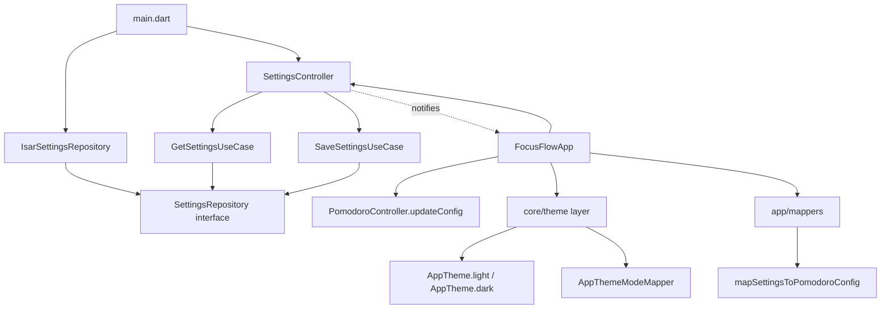

# Design Document — Settings

## Overview

The Settings feature adds a centralized preferences screen to Focus Flow, allowing users to configure Pomodoro durations, cycle count, sound toggle, theme mode, and color palette. It follows the existing feature-first clean architecture with an Isar-backed repository, a ChangeNotifier controller provided at application scope (above MaterialApp), and immediate-persist optimistic UI. Theme and palette changes propagate globally via the existing provider tree, while Pomodoro config changes are delivered to PomodoroController through a ProxyProvider2, respecting the timer's running/paused state by deferring application.

## Architecture

```
┌─────────────────────────────────────────────────────────┐
│ main.dart                                               │
│  openIsar() → IsarSettingsRepository → SettingsController│
│  await settingsController.init()                        │
│  runApp(FocusFlowApp(isar, settingsController))         │
└─────────────────────────────────────────────────────────┘
         │
         ▼
┌─────────────────────────────────────────────────────────┐
│ FocusFlowApp (app.dart)                                 │
│  MultiProvider                                          │
│   ├─ ChangeNotifierProvider.value(settingsController)   │
│   ├─ Provider<PomodoroSessionRepository>                │
│   ├─ ChangeNotifierProvider<TodoController>             │
│   └─ ChangeNotifierProxyProvider2<                      │
│        TodoController, SettingsController,              │
│        PomodoroController>                              │
│  MaterialApp                                            │
│   ├─ themeMode: settings.themeMode.toFlutterThemeMode() │
│   ├─ theme: AppTheme.light(settings.colorPalette)       │
│   └─ darkTheme: AppTheme.dark(settings.colorPalette)    │
└─────────────────────────────────────────────────────────┘
```

Settings lives in `lib/features/settings/` following the standard `data/`, `domain/`, `presentation/` split. The controller is initialized synchronously (awaited) in `main.dart` before `runApp`, guaranteeing the theme is resolved before the first frame paints.

### Dependency Flow



## Components and Interfaces

### Domain Layer

#### Entities

**AppSettings** — Immutable value object representing all user preferences.

```dart
class AppSettings {
  const AppSettings({
    this.focusDuration = const Duration(minutes: 25),
    this.shortBreakDuration = const Duration(minutes: 5),
    this.longBreakDuration = const Duration(minutes: 15),
    this.cyclesBeforeLongBreak = 4,
    this.soundEnabled = true,
    this.themeMode = AppThemeMode.system,
    this.colorPalette = AppColorPalette.salmon,
  });

  final Duration focusDuration;
  final Duration shortBreakDuration;
  final Duration longBreakDuration;
  final int cyclesBeforeLongBreak;
  final bool soundEnabled;
  final AppThemeMode themeMode;
  final AppColorPalette colorPalette;

  AppSettings copyWith({...});

  @override
  bool operator ==(Object other) { ... }

  @override
  int get hashCode { ... }
}
```

**AppThemeMode** — Pure Dart enum representing the application brightness mode.

```dart
enum AppThemeMode {
  system,
  light,
  dark;
}
```

**AppColorPalette** — Pure Dart enum representing the selectable color palette.

```dart
enum AppColorPalette {
  salmon,
  lightBlue,
  lightGreen;
}
```

These domain enums contain no Flutter imports. The mapping to Flutter types (ThemeMode, Color, ThemeData) happens in the centralized theme layer under `lib/core/theme/`.

#### Repository Interface

```dart
abstract interface class SettingsRepository {
  Future<AppSettings?> getSettings();
  Future<void> saveSettings(AppSettings settings);
}
```

Returns `null` when no record exists (first launch). The controller interprets `null` as "use defaults".

#### Use Cases

**GetSettingsUseCase** — Reads persisted settings or returns null.

```dart
class GetSettingsUseCase {
  const GetSettingsUseCase({required this.repository});
  final SettingsRepository repository;
  Future<AppSettings?> call() => repository.getSettings();
}
```

**SaveSettingsUseCase** — Persists the full AppSettings record.

```dart
class SaveSettingsUseCase {
  const SaveSettingsUseCase({required this.repository});
  final SettingsRepository repository;
  Future<void> call(AppSettings settings) =>
      repository.saveSettings(settings);
}
```

### Data Layer

**AppSettingsModel** — Isar `@collection` with a fixed `id = 1`.

```dart
@collection
class AppSettingsModel {
  Id id = 1;

  int focusDurationMinutes = 25;
  int shortBreakDurationMinutes = 5;
  int longBreakDurationMinutes = 15;
  int cyclesBeforeLongBreak = 4;
  bool soundEnabled = true;

  @enumerated
  AppThemeMode themeMode = AppThemeMode.system;

  @enumerated
  AppColorPalette colorPalette = AppColorPalette.salmon;

  AppSettings toEntity() { ... }

  static AppSettingsModel fromEntity(AppSettings entity) { ... }
}
```

**IsarSettingsRepository** — Concrete implementation.

```dart
class IsarSettingsRepository implements SettingsRepository {
  const IsarSettingsRepository({required this.isar});
  final Isar isar;

  @override
  Future<AppSettings?> getSettings() async {
    final model = await isar.appSettingsModels.get(1);
    return model?.toEntity();
  }

  @override
  Future<void> saveSettings(AppSettings settings) async {
    await isar.writeTxn(() async {
      await isar.appSettingsModels.put(
        AppSettingsModel.fromEntity(settings),
      );
    });
  }
}
```

### Core Theme Layer

The centralized theme layer lives at `lib/core/theme/` and contains all Flutter-specific color and theme mappings. Domain enums remain pure Dart; this layer bridges them to Flutter's Material system.

**`lib/core/theme/app_theme_mode_mapper.dart`** — Extension mapping AppThemeMode to Flutter ThemeMode.

```dart
import 'package:flutter/material.dart';
import '../../features/settings/domain/entities/app_theme_mode.dart';

extension AppThemeModeMapper on AppThemeMode {
  ThemeMode toFlutterThemeMode() => switch (this) {
    AppThemeMode.system => ThemeMode.system,
    AppThemeMode.light => ThemeMode.light,
    AppThemeMode.dark => ThemeMode.dark,
  };
}
```

**`lib/core/theme/app_palette_seeds.dart`** — Palette seed Color constants and helper function.

```dart
import 'package:flutter/material.dart';
import '../../features/settings/domain/entities/app_color_palette.dart';

abstract final class AppPaletteSeeds {
  static const Color salmon = Color(0xFFE57373);
  static const Color lightBlue = Color(0xFF4FC3F7);
  static const Color lightGreen = Color(0xFF81C784);

  static Color seedForPalette(AppColorPalette palette) => switch (palette) {
    AppColorPalette.salmon => salmon,
    AppColorPalette.lightBlue => lightBlue,
    AppColorPalette.lightGreen => lightGreen,
  };
}
```

**`lib/core/theme/app_theme.dart`** — AppTheme factory methods for ThemeData.

```dart
import 'package:flutter/material.dart';
import '../../features/settings/domain/entities/app_color_palette.dart';
import 'app_palette_seeds.dart';

abstract final class AppTheme {
  static ThemeData light(AppColorPalette palette) => ThemeData(
    colorScheme: ColorScheme.fromSeed(
      seedColor: AppPaletteSeeds.seedForPalette(palette),
      brightness: Brightness.light,
    ),
    useMaterial3: true,
  );

  static ThemeData dark(AppColorPalette palette) => ThemeData(
    colorScheme: ColorScheme.fromSeed(
      seedColor: AppPaletteSeeds.seedForPalette(palette),
      brightness: Brightness.dark,
    ),
    useMaterial3: true,
  );
}
```

### Application Mappers Layer

**`lib/app/mappers/pomodoro_settings_mapper.dart`** — Maps AppSettings to PomodoroConfig at the composition layer, keeping the settings domain decoupled from the pomodoro domain.

```dart
import '../../features/pomodoro/domain/entities/pomodoro_config.dart';
import '../../features/settings/domain/entities/app_settings.dart';

PomodoroConfig mapSettingsToPomodoroConfig(AppSettings settings) {
  return PomodoroConfig(
    focusDuration: settings.focusDuration,
    shortBreakDuration: settings.shortBreakDuration,
    longBreakDuration: settings.longBreakDuration,
    sessionsBeforeLongBreak: settings.cyclesBeforeLongBreak,
  );
}
```

### Presentation Layer

**SettingsController** — Application-scoped ChangeNotifier managing settings state.

```dart
enum SettingsStatus { loading, loaded, error }

class SettingsController extends ChangeNotifier {
  SettingsController({
    required GetSettingsUseCase getSettingsUseCase,
    required SaveSettingsUseCase saveSettingsUseCase,
  });

  SettingsStatus get status;
  AppSettings get settings;
  String? get errorMessage;

  Future<void> init(); // loads settings, sets status
  Future<void> retry(); // retries failed load

  // Mutation methods — validate, update in-memory, persist, revert on failure
  Future<void> updateFocusDuration(int minutes);
  Future<void> updateShortBreakDuration(int minutes);
  Future<void> updateLongBreakDuration(int minutes);
  Future<void> updateCyclesBeforeLongBreak(int cycles);
  Future<void> updateSoundEnabled(bool enabled);
  Future<void> updateThemeMode(AppThemeMode mode);
  Future<void> updateColorPalette(AppColorPalette palette);
}
```

The controller does **not** construct ThemeData or ColorScheme. It exposes only `AppSettings` and `SettingsStatus`. The Flutter-specific theme construction is handled by the `core/theme` layer, consumed directly by MaterialApp.

**Validation logic** lives in the controller. Each `update*` method:
1. Validates the new value against the field's range.
2. If invalid: retains previous value, notifies with validation error.
3. If valid: creates a new AppSettings via `copyWith`, updates in-memory state, calls `notifyListeners()`, persists asynchronously.
4. If persistence fails: reverts in-memory state to the last successfully persisted snapshot, notifies again, causing the UI and global theme/palette to revert.

**SettingsScreen** — Scaffold with AppBar("Settings") and a ListView body containing three section widgets.

**PomodoroSettingsSection** — ListTile per duration (focus, short break, long break, cycles). Each shows current value with "min" suffix. Tapping opens a dialog with a number picker constrained to the field's valid range.

**AppearanceSettingsSection** — SegmentedButton<AppThemeMode> for theme mode. Custom palette selector row with labeled color swatches and a check-mark selection indicator.

**SoundSettingsSection** — SwitchListTile for sound toggle with secondary text "Enabled" / "Disabled".

### Theme Integration

In `app.dart`, the `MaterialApp` consumes theme data from the `core/theme` layer, reading the current palette and theme mode from `SettingsController`:

```dart
// In app.dart build method:
final settingsController = context.watch<SettingsController>();
final settings = settingsController.settings;

MaterialApp(
  themeMode: settings.themeMode.toFlutterThemeMode(),  // from extension in core/theme
  theme: AppTheme.light(settings.colorPalette),
  darkTheme: AppTheme.dark(settings.colorPalette),
  ...
)
```

Since `SettingsController` is a `ChangeNotifier` provided above `MaterialApp` via `ChangeNotifierProvider.value`, any change to theme mode or palette triggers a rebuild of `MaterialApp` with the new theme in the same frame.

### Pomodoro Integration

**PomodoroController changes:**

1. Change `final PomodoroConfig _config` to `PomodoroConfig _config` (remove `final`).
2. Add `updateConfig(PomodoroConfig newConfig)` method:

```dart
void updateConfig(PomodoroConfig newConfig) {
  if (newConfig == _config) return; // no-op on identical config
  _config = newConfig;
  if (_status == TimerStatus.idle || _status == TimerStatus.completed) {
    _remainingDuration = _config.durationFor(_currentMode);
  }
  // Running/Paused: _remainingDuration unchanged (deferred)
  notifyListeners();
}
```

3. In `app.dart`: upgrade the existing `ChangeNotifierProxyProvider<TodoController, PomodoroController>` to `ChangeNotifierProxyProvider2<TodoController, SettingsController, PomodoroController>`. The `update` callback:
   - Calls `updateAvailableTasks(tasks)` as before.
   - Calls `updateConfig(mapSettingsToPomodoroConfig(settingsController.settings))` using the top-level mapper function from `lib/app/mappers/pomodoro_settings_mapper.dart`.

### Navigation Integration

- Add `static const String settings = '/settings'` to `Routes`.
- Add `case Routes.settings:` in `onGenerateRoute` returning `MaterialPageRoute<void>` to `SettingsScreen`.
- In `HomeScreen`: add a 4th `NavigationDestination` (Icons.settings_outlined / Icons.settings, label "Settings") and a 4th child in `IndexedStack` (`const SettingsScreen()`).
- Update `_hasSelectedStatistics` lazy-load logic to account for new index (Statistics remains at index 2, Settings at index 3).

### Startup Sequence

```dart
void main() async {
  WidgetsFlutterBinding.ensureInitialized();
  final isar = await openIsar();

  // Settings — initialized before runApp to avoid theme flash
  final settingsRepository = IsarSettingsRepository(isar: isar);
  final settingsController = SettingsController(
    getSettingsUseCase: GetSettingsUseCase(repository: settingsRepository),
    saveSettingsUseCase: SaveSettingsUseCase(repository: settingsRepository),
  );
  await settingsController.init();

  await SeedDefaultCategoriesUseCase(
    categoryRepository: IsarCategoryRepository(isar: isar),
  ).call();

  runApp(FocusFlowApp(isar: isar, settingsController: settingsController));
}
```

## Data Models

### Isar Collection Schema

```
AppSettingsModel
├── id: int (always 1)
├── focusDurationMinutes: int
├── shortBreakDurationMinutes: int
├── longBreakDurationMinutes: int
├── cyclesBeforeLongBreak: int
├── soundEnabled: bool
├── themeMode: int (enum index)
└── colorPalette: int (enum index)
```

### Domain Entity

```
AppSettings (immutable, copyWith, equality)
├── focusDuration: Duration
├── shortBreakDuration: Duration
├── longBreakDuration: Duration
├── cyclesBeforeLongBreak: int
├── soundEnabled: bool
├── themeMode: AppThemeMode
└── colorPalette: AppColorPalette
```

### Validation Ranges

| Field | Min | Max | Default |
|-------|-----|-----|---------|
| focusDuration (minutes) | 1 | 120 | 25 |
| shortBreakDuration (minutes) | 1 | 60 | 5 |
| longBreakDuration (minutes) | 1 | 120 | 15 |
| cyclesBeforeLongBreak | 1 | 12 | 4 |
| soundEnabled | — | — | true |
| themeMode | — | — | system |
| colorPalette | — | — | salmon |

### Migration Strategy

- First version: if the Isar record doesn't exist (ID 1 not found), the controller uses hardcoded defaults.
- Future schema additions: new nullable fields with defaults in `toEntity()`.
- Unknown enum index (from future downgrade): map to first enum value (safe fallback).

### Design Decisions

**Open Question 1 — Default color palette**: Resolved as `AppColorPalette.salmon` (maps to "Warm", which is listed first in ui-philosophy.md).

**Open Question 2 — Palette naming reconciliation**: The mapping is:
- "Warm" (ui-philosophy) → Salmon (product)
- "Ocean" (ui-philosophy) → Light Blue (product)
- "Nature" (ui-philosophy) → Light Green (product)

The enum uses the product names (`salmon`, `lightBlue`, `lightGreen`) since those are user-facing labels. The ui-philosophy family names are conceptual groupings documented here for traceability.

**Open Question 3 — Exact color seed values**:
- Salmon: `Color(0xFFE57373)` — a warm coral red from Material red-300.
- Light Blue: `Color(0xFF4FC3F7)` — a clear sky blue from Material lightBlue-300.
- Light Green: `Color(0xFF81C784)` — a natural green from Material green-300.

These seeds produce harmonious light and dark schemes via `ColorScheme.fromSeed`.

### Contrast and Accessibility Note

ColorScheme.fromSeed provides the base Material 3 tonal palette. Standard Material components generally consume appropriate color roles. However, contrast must still be manually verified during implementation for: custom palette preview widgets, custom backgrounds or containers, disabled states, text placed over custom colors, and both light and dark modes. No blanket WCAG guarantee is claimed without manual verification.

## Correctness Properties

*A property is a characteristic or behavior that should hold true across all valid executions of a system — essentially, a formal statement about what the system should do. Properties serve as the bridge between human-readable specifications and machine-verifiable correctness guarantees.*

### Property 1: Settings round-trip persistence

*For any* valid `AppSettings` value, saving it via `SaveSettingsUseCase` and then loading it via `GetSettingsUseCase` SHALL produce an `AppSettings` value that is equal to the original.

**Validates: Requirements 1.2, 1.3, 3.5, 4.2, 4.4, 5.6, 5.9, 6.3**

### Property 2: Duration and cycle validation accepts only in-range values

*For any* setting field (focus duration, short break duration, long break duration, cycles before long break) and *for any* integer value, the `SettingsController` SHALL accept the value if and only if it falls within the field's defined valid range (focus: 1–120, short break: 1–60, long break: 1–120, cycles: 1–12). Out-of-range values SHALL leave the persisted state unchanged.

**Validates: Requirements 2.2, 2.3, 2.4, 2.5, 3.2, 3.3**

### Property 3: Config applies immediately when timer is idle or completed

*For any* config update received by `PomodoroController` while `TimerStatus` is `idle` or `completed`, the `remainingDuration` SHALL equal the new config's duration for the current `TimerMode`.

**Validates: Requirements 7.1, 7.2, 7.3, 7.6, 7.7**

### Property 4: Config is deferred when timer is running or paused

*For any* config update received by `PomodoroController` while `TimerStatus` is `running` or `paused`, the `remainingDuration`, `_targetEndTime`, `TimerMode`, `cycleCount`, and selected task association SHALL remain unchanged.

**Validates: Requirements 7.5, 7.9**

### Property 5: Atomic config replacement

*For any* call to `PomodoroController.updateConfig(newConfig)`, all fields of the controller's internal `_config` (focusDuration, shortBreakDuration, longBreakDuration, sessionsBeforeLongBreak) SHALL equal the corresponding fields of `newConfig` after the call completes.

**Validates: Requirements 7.8**

### Property 6: Save failure preserves persisted state

*For any* sequence of successful saves followed by a failed save attempt, the settings returned by the next successful `getSettings()` call SHALL equal the last successfully saved `AppSettings`, not the failed attempt's values.

**Validates: Requirements 9.6, 11.5**

### Property 7: Palette generates valid ColorScheme for all variants

*For any* `AppColorPalette` value, calling `ColorScheme.fromSeed(seedColor: seedForPalette(palette), brightness: b)` for both `Brightness.light` and `Brightness.dark` SHALL produce a non-null `ColorScheme` without throwing. Note: this property verifies generation success, not WCAG contrast compliance — contrast requires manual verification.

**Validates: Requirements 5.5, 6.2**

## Error Handling

### Load Errors

| Scenario | Controller Behavior | UI Behavior |
|----------|-------------------|-------------|
| Record not found (null) | Uses defaults, status = `loaded` | Renders normally with defaults |
| Isar read exception | status = `error`, exposes errorMessage | Shows error message + Retry button |
| Load exceeds 300ms | status = `loading` during wait | Shows CircularProgressIndicator |

### Save Errors

| Scenario | Controller Behavior | UI Behavior |
|----------|-------------------|-------------|
| Isar write exception | Reverts in-memory settings to last persisted snapshot, notifies | SnackBar (4s) indicating which field failed to save |
| Validation rejection | Retains previous valid value, no persistence attempt | Inline message indicating allowed range |

For theme mode and palette failures, the global application appearance also reverts because SettingsController state is rolled back and MaterialApp rebuilds from the reverted settings.

### Invariants During Errors

- The controller never overwrites a valid persisted record with defaults after a failure.
- A save failure does not corrupt the in-memory state — it cleanly reverts.
- Multiple rapid changes that fail in sequence each revert independently to the same last-known-good state.

## Testing Strategy

### Unit Tests

**SettingsController:**
- Default values on first load (empty repository)
- Load from existing record
- Load failure → error state with retry
- Each update method with valid value → persists and notifies
- Each update method with invalid value → rejects, retains previous
- Save failure → reverts to last persisted state
- Theme mode update triggers notify (3 enum values)

**PomodoroController.updateConfig:**
- Config applies when idle → remainingDuration updates
- Config applies when completed → remainingDuration updates
- Config ignored when running → remainingDuration unchanged
- Config ignored when paused → remainingDuration unchanged
- Atomic replacement of all config fields
- cycleCount, status, selectedTask preserved across updateConfig

**AppSettings:**
- copyWith produces correct values
- Equality and default construction

**mapSettingsToPomodoroConfig:**
- mapSettingsToPomodoroConfig maps durations correctly

**AppSettingsModel:**
- toEntity/fromEntity round-trip
- Default field values match domain defaults

### Property-Based Tests

Library: `fast_check` (Dart property-based testing library)

Each test runs a minimum of 100 iterations and is tagged with its corresponding property.

| Property | Generator Strategy |
|----------|-------------------|
| P1: Round-trip | Generate random valid AppSettings (durations in range, random enum values, random bool) |
| P2: Validation | Generate random (field, value) pairs — both in-range and out-of-range integers |
| P3: Config applies when idle | Generate random valid PomodoroConfig + random TimerMode, start from idle/completed |
| P4: Config deferred when active | Generate random valid PomodoroConfig, set up running/paused state with random remaining |
| P5: Atomic replacement | Generate two random PomodoroConfigs, apply second, verify all fields match |
| P6: Save failure preserves state | Generate random valid settings, mock save to throw, verify get returns previous |
| P7: Palette ColorScheme | Iterate all AppColorPalette values × 2 brightness values (exhaustive, not random) |

### Widget Tests

- SettingsScreen renders all three sections in correct order
- Duration controls show current values and respond to changes
- Theme SegmentedButton reflects current mode and triggers update
- Palette selector shows swatches with labels and selection indicator
- SwitchListTile reflects sound state
- Save failure shows SnackBar and reverts control
- Loading state shows CircularProgressIndicator
- Error state shows message and Retry button
- Navigation: 4 tabs, Settings at index 3, IndexedStack preserves state
- Accessibility: Semantics labels present, 48dp touch targets

### Integration Tests

- Full startup sequence: openIsar → init controller → runApp → verify theme applied
- Settings persisted across simulated app restart (write, close, reopen, verify)
- ProxyProvider2 delivers config changes to PomodoroController

## Files to Create/Modify

### Create

| Path | Purpose |
|------|---------|
| `lib/features/settings/domain/entities/app_settings.dart` | Domain entity with copyWith, equality (no Flutter imports) |
| `lib/features/settings/domain/entities/app_theme_mode.dart` | Pure Dart ThemeMode enum (no Flutter imports) |
| `lib/features/settings/domain/entities/app_color_palette.dart` | Pure Dart ColorPalette enum (no Flutter imports) |
| `lib/features/settings/domain/repositories/settings_repository.dart` | Abstract interface |
| `lib/features/settings/domain/use_cases/get_settings_use_case.dart` | Read use case |
| `lib/features/settings/domain/use_cases/save_settings_use_case.dart` | Write use case |
| `lib/features/settings/data/models/app_settings_model.dart` | Isar @collection |
| `lib/features/settings/data/repositories/isar_settings_repository.dart` | Concrete repository |
| `lib/features/settings/presentation/controllers/settings_controller.dart` | App-scoped ChangeNotifier |
| `lib/features/settings/presentation/screens/settings_screen.dart` | Main settings screen |
| `lib/features/settings/presentation/widgets/pomodoro_settings_section.dart` | Duration/cycle controls |
| `lib/features/settings/presentation/widgets/appearance_settings_section.dart` | Theme + palette controls |
| `lib/features/settings/presentation/widgets/sound_settings_section.dart` | Sound toggle |
| `lib/core/theme/app_theme_mode_mapper.dart` | Extension mapping AppThemeMode to Flutter ThemeMode |
| `lib/core/theme/app_palette_seeds.dart` | Palette seed Color constants and seedForPalette helper |
| `lib/core/theme/app_theme.dart` | AppTheme.light/dark factory methods for ThemeData |
| `lib/app/mappers/pomodoro_settings_mapper.dart` | Maps AppSettings to PomodoroConfig at composition layer |

### Modify

| Path | Change |
|------|--------|
| `lib/core/database/isar_database.dart` | Add `AppSettingsModelSchema` to schema list |
| `lib/main.dart` | Create IsarSettingsRepository + SettingsController, await init, pass to FocusFlowApp |
| `lib/app/app.dart` | Accept settingsController param, provide via .value, use AppTheme.light/dark and toFlutterThemeMode from core/theme, upgrade to ProxyProvider2 with mapSettingsToPomodoroConfig |
| `lib/app/router.dart` | Add `Routes.settings`, add case for `/settings` route |
| `lib/features/home/presentation/screens/home_screen.dart` | Add 4th NavigationDestination + IndexedStack child |
| `lib/features/pomodoro/presentation/controllers/pomodoro_controller.dart` | Make `_config` non-final, add `updateConfig` method |

### Remove or Supersede

| Path | Reason |
|------|--------|
| `lib/app/theme/app_theme.dart` | Superseded by `lib/core/theme/app_theme.dart` — remove empty file or redirect |
| `lib/app/theme/app_colors.dart` | Superseded by `lib/core/theme/app_palette_seeds.dart` — remove empty file or redirect |
