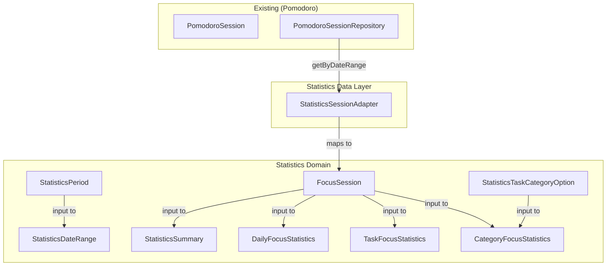
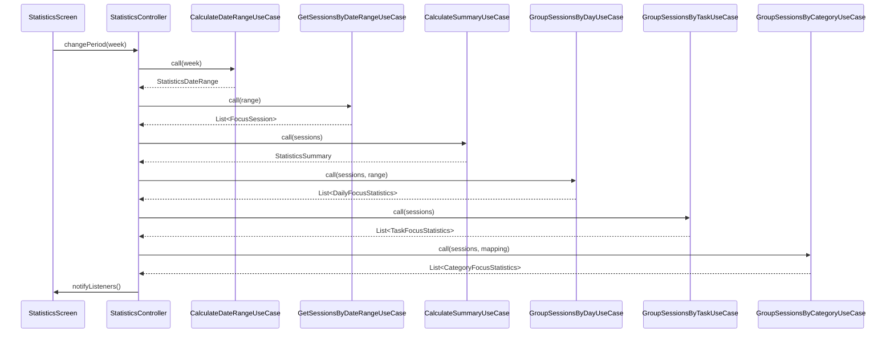

# Design Document — Statistics Feature

## Overview

The Statistics feature provides users with productivity insights derived from completed Pomodoro focus sessions. It computes summary metrics (total time, session count, average duration), groups sessions by calendar day for a bar-chart visualization, and breaks down focus time by task and category. All computation is performed on-device using existing `PomodoroSession` data — no new Isar collection is created.

The feature follows Feature-First Clean Architecture under `lib/features/statistics/`. It defines its own domain entities and use cases, accessing Pomodoro session data through a Statistics-owned abstract interface (`StatisticsSessionSource`) implemented by an adapter in the data layer. The `Clock` abstraction is shared by relocating it to `core/utils/`. Cross-feature category resolution uses a read-only `StatisticsTaskCategoryOption` mapping provided at the app composition root.

The `StatisticsController` is route-scoped (created on route entry, disposed on route exit) since statistics data does not need to survive navigation — it reloads fresh on every visit.

---

## Architecture

### Directory Layout

```
lib/features/statistics/
├── data/
│   └── repositories/
│       └── statistics_session_adapter.dart    # Implements StatisticsSessionSource
├── domain/
│   ├── entities/
│   │   ├── statistics_period.dart             # Enum: today, week, month
│   │   ├── statistics_date_range.dart         # Value object: start, end
│   │   ├── statistics_summary.dart            # Aggregate metrics
│   │   ├── daily_focus_statistics.dart        # Per-day data
│   │   ├── task_focus_statistics.dart         # Per-task breakdown
│   │   ├── category_focus_statistics.dart     # Per-category breakdown
│   │   ├── focus_session.dart                 # Statistics-owned session DTO
│   │   └── statistics_task_category_option.dart  # Task-to-category mapping entry
│   ├── repositories/
│   │   └── statistics_session_source.dart     # Abstract interface
│   └── use_cases/
│       ├── calculate_date_range_use_case.dart
│       ├── get_sessions_by_date_range_use_case.dart
│       ├── calculate_summary_use_case.dart
│       ├── group_sessions_by_day_use_case.dart
│       ├── group_sessions_by_task_use_case.dart
│       └── group_sessions_by_category_use_case.dart
├── presentation/
│   ├── controllers/
│   │   └── statistics_controller.dart
│   ├── screens/
│   │   └── statistics_screen.dart
│   └── widgets/
│       ├── period_selector.dart
│       ├── summary_cards_row.dart
│       ├── daily_activity_chart.dart
│       ├── task_breakdown_list.dart
│       ├── category_breakdown_list.dart
│       └── breakdown_item.dart
└── statistics_module.dart                     # Optional feature exports
```

### Dependency Rules

- `presentation/` depends only on `domain/entities/` and the controller.
- `data/` implements the `StatisticsSessionSource` interface from `domain/repositories/`.
- The Statistics domain layer does **not** import from Flutter, Provider, Isar, or any other feature's `data/` or `domain/` layers.
- The `StatisticsSessionAdapter` (data layer) wraps the existing `PomodoroSessionRepository` and maps `PomodoroSession` → `FocusSession`.
- `Clock` is consumed from `core/utils/clock.dart` (shared location).

### Clock Sharing Strategy

The `Clock` abstraction currently lives in `features/pomodoro/domain/entities/clock.dart`. Since Statistics also requires it, the design relocates it to `core/utils/clock.dart`. Both Pomodoro and Statistics import from the shared location. This avoids a cross-feature domain dependency.

### Provider Scope Decision

The `StatisticsController` is **route-scoped** — created via `ChangeNotifierProvider` inside the `/statistics` route builder and disposed when the user navigates away. Unlike the Pomodoro timer (which must survive navigation), statistics data is derived on-demand and benefits from a fresh load each visit.

---

## Components and Interfaces

### Domain Entities

```dart
// lib/features/statistics/domain/entities/statistics_period.dart
enum StatisticsPeriod { today, week, month }
```

```dart
// lib/features/statistics/domain/entities/statistics_date_range.dart

/// Immutable value object representing a UTC date range [start, end).
class StatisticsDateRange {
  const StatisticsDateRange({required this.start, required this.end});

  /// Inclusive start boundary (UTC).
  final DateTime start;

  /// Exclusive end boundary (UTC).
  final DateTime end;
}
```

```dart
// lib/features/statistics/domain/entities/focus_session.dart

/// Statistics-owned DTO containing only the fields needed for computation.
/// Mapped from PomodoroSession in the adapter layer.
class FocusSession {
  const FocusSession({
    required this.startedAt,
    required this.actualDurationSeconds,
    this.taskId,
    this.taskTitleSnapshot,
  });

  /// UTC timestamp when the session started.
  final DateTime startedAt;

  /// Active focused time in seconds.
  final int actualDurationSeconds;

  /// Optional reference to the associated task.
  final int? taskId;

  /// Snapshot of the task title at persistence time.
  final String? taskTitleSnapshot;
}
```

```dart
// lib/features/statistics/domain/entities/statistics_summary.dart

/// Aggregate metrics for a date range.
class StatisticsSummary {
  const StatisticsSummary({
    required this.totalFocusedSeconds,
    required this.sessionCount,
    required this.averageSessionSeconds,
  });

  final int totalFocusedSeconds;
  final int sessionCount;
  final int averageSessionSeconds;
}
```

```dart
// lib/features/statistics/domain/entities/daily_focus_statistics.dart

/// Focus data for a single calendar day.
class DailyFocusStatistics {
  const DailyFocusStatistics({
    required this.date,
    required this.totalFocusedSeconds,
    required this.sessionCount,
  });

  /// The local calendar day (time component zeroed).
  final DateTime date;

  /// Total focused seconds for this day.
  final int totalFocusedSeconds;

  /// Number of completed sessions on this day.
  final int sessionCount;
}
```

```dart
// lib/features/statistics/domain/entities/task_focus_statistics.dart

/// Focus data grouped by task.
class TaskFocusStatistics {
  const TaskFocusStatistics({
    required this.taskId,
    required this.displayTitle,
    required this.totalFocusedSeconds,
    required this.sessionCount,
    required this.percentage,
  });

  /// Null for the "No task" group.
  final int? taskId;

  /// Display title: taskTitleSnapshot or "No task".
  final String displayTitle;

  final int totalFocusedSeconds;
  final int sessionCount;

  /// Percentage of total focused time (0.0–1.0).
  final double percentage;
}
```

```dart
// lib/features/statistics/domain/entities/category_focus_statistics.dart

/// Focus data grouped by category.
class CategoryFocusStatistics {
  const CategoryFocusStatistics({
    required this.categoryId,
    required this.displayName,
    required this.totalFocusedSeconds,
    required this.sessionCount,
    required this.percentage,
  });

  /// Null for the "Uncategorized" group.
  final int? categoryId;

  /// Category name or "Uncategorized".
  final String displayName;

  final int totalFocusedSeconds;
  final int sessionCount;

  /// Percentage of total focused time (0.0–1.0).
  final double percentage;
}
```

```dart
// lib/features/statistics/domain/entities/statistics_task_category_option.dart

/// Read-only mapping entry from a task to its category.
/// Provided by the app composition root from TodoController data.
class StatisticsTaskCategoryOption {
  const StatisticsTaskCategoryOption({
    required this.taskId,
    this.categoryId,
    this.categoryName,
  });

  final int taskId;

  /// Null means the task has no category assigned.
  final int? categoryId;

  /// Category display name, or null if uncategorized.
  final String? categoryName;
}
```

### Repository Interface

```dart
// lib/features/statistics/domain/repositories/statistics_session_source.dart

/// Abstract interface for retrieving focus sessions.
/// Implemented by the adapter in data/ layer.
abstract interface class StatisticsSessionSource {
  /// Returns focus sessions whose startedAt falls within [start, end).
  Future<List<FocusSession>> getSessionsByDateRange({
    required DateTime start,
    required DateTime end,
  });
}
```

### Data Layer — Adapter

```dart
// lib/features/statistics/data/repositories/statistics_session_adapter.dart

/// Implements StatisticsSessionSource by delegating to the existing
/// PomodoroSessionRepository and mapping PomodoroSession → FocusSession.
///
/// Only sessions with timerMode == TimerMode.focus are included.
class StatisticsSessionAdapter implements StatisticsSessionSource {
  const StatisticsSessionAdapter({
    required PomodoroSessionRepository pomodoroSessionRepository,
  });

  @override
  Future<List<FocusSession>> getSessionsByDateRange({
    required DateTime start,
    required DateTime end,
  }) async {
    final sessions = await _repository.getByDateRange(
      start: start,
      end: end,
    );
    return sessions
        .where((s) => s.timerMode == TimerMode.focus)
        .map((s) => FocusSession(
              startedAt: s.startedAt,
              actualDurationSeconds: s.actualDurationSeconds,
              taskId: s.taskId,
              taskTitleSnapshot: s.taskTitleSnapshot,
            ))
        .toList();
  }
}
```

### Use Cases

All use cases are pure Dart (no Flutter imports). Each has a single `call()` method.

```dart
// lib/features/statistics/domain/use_cases/calculate_date_range_use_case.dart

/// Computes UTC query boundaries from a StatisticsPeriod and Clock.
class CalculateDateRangeUseCase {
  const CalculateDateRangeUseCase({required Clock clock});

  /// Returns [start, end) range in UTC for the given period.
  StatisticsDateRange call(StatisticsPeriod period);
}
```

**Date range logic:**
- **Today**: start = local today 00:00 → UTC; end = local tomorrow 00:00 → UTC.
- **Week**: start = most recent Monday 00:00 local → UTC; end = following Monday 00:00 local → UTC.
- **Month**: start = 1st of current month 00:00 local → UTC; end = 1st of next month 00:00 local → UTC.

All conversions respect the device's local timezone. The Clock provides current UTC time; the use case converts to local to determine the calendar boundaries, then converts boundaries back to UTC for querying.

```dart
// lib/features/statistics/domain/use_cases/get_sessions_by_date_range_use_case.dart

class GetSessionsByDateRangeUseCase {
  const GetSessionsByDateRangeUseCase({
    required StatisticsSessionSource sessionSource,
  });

  Future<List<FocusSession>> call(StatisticsDateRange range);
}
```

```dart
// lib/features/statistics/domain/use_cases/calculate_summary_use_case.dart

/// Pure computation: List<FocusSession> → StatisticsSummary.
class CalculateSummaryUseCase {
  const CalculateSummaryUseCase();

  StatisticsSummary call(List<FocusSession> sessions);
}
```

**Summary logic:**
- `totalFocusedSeconds` = sum of `actualDurationSeconds` across all sessions.
- `sessionCount` = `sessions.length`.
- `averageSessionSeconds` = `sessionCount > 0 ? totalFocusedSeconds ~/ sessionCount : 0`.

```dart
// lib/features/statistics/domain/use_cases/group_sessions_by_day_use_case.dart

/// Groups sessions by local calendar day with zero-fill for empty days.
class GroupSessionsByDayUseCase {
  const GroupSessionsByDayUseCase();

  /// Returns one DailyFocusStatistics per calendar day in [range],
  /// ordered chronologically.
  List<DailyFocusStatistics> call(
    List<FocusSession> sessions,
    StatisticsDateRange range,
  );
}
```

**Daily grouping logic:**
1. Convert `range.start` and `range.end` from UTC to local to determine the calendar days.
2. Generate one entry for each calendar day from start (inclusive) to end (exclusive).
3. For each session, convert `startedAt` to local and assign to the matching day bucket.
4. Sum `actualDurationSeconds` and count sessions per bucket.
5. Days with no sessions have `totalFocusedSeconds = 0` and `sessionCount = 0`.

```dart
// lib/features/statistics/domain/use_cases/group_sessions_by_task_use_case.dart

/// Groups sessions by taskId and computes per-task statistics.
class GroupSessionsByTaskUseCase {
  const GroupSessionsByTaskUseCase();

  /// Returns task groups sorted by totalFocusedSeconds descending,
  /// ties broken by displayTitle alphabetically.
  List<TaskFocusStatistics> call(List<FocusSession> sessions);
}
```

**Task grouping logic:**
1. Group sessions by `taskId`. Null `taskId` sessions form one group with displayTitle "No task".
2. For non-null groups, use the `taskTitleSnapshot` of the first session in the group as the display title (all sessions for the same taskId share the same snapshot).
3. Compute `totalFocusedSeconds`, `sessionCount`, `percentage` (group total / grand total).
4. Sort by `totalFocusedSeconds` descending; break ties by `displayTitle` alphabetically (case-insensitive).

```dart
// lib/features/statistics/domain/use_cases/group_sessions_by_category_use_case.dart

/// Groups sessions by category using the provided task-to-category mapping.
class GroupSessionsByCategoryUseCase {
  const GroupSessionsByCategoryUseCase();

  /// Returns category groups sorted by totalFocusedSeconds descending.
  List<CategoryFocusStatistics> call(
    List<FocusSession> sessions,
    List<StatisticsTaskCategoryOption> taskCategoryMapping,
  );
}
```

**Category grouping logic:**
1. Build a `Map<int, StatisticsTaskCategoryOption>` from the mapping list for O(1) lookups.
2. For each session: look up `taskId` in the map. If found and `categoryId` is non-null, assign to that category. Otherwise, assign to "Uncategorized" (categoryId = null).
3. Compute `totalFocusedSeconds`, `sessionCount`, `percentage` per group.
4. Sort by `totalFocusedSeconds` descending.

### StatisticsController

```dart
// lib/features/statistics/presentation/controllers/statistics_controller.dart

/// Manages all Statistics screen state. Route-scoped via ChangeNotifierProvider.
class StatisticsController extends ChangeNotifier {
  StatisticsController({
    required CalculateDateRangeUseCase calculateDateRangeUseCase,
    required GetSessionsByDateRangeUseCase getSessionsByDateRangeUseCase,
    required CalculateSummaryUseCase calculateSummaryUseCase,
    required GroupSessionsByDayUseCase groupSessionsByDayUseCase,
    required GroupSessionsByTaskUseCase groupSessionsByTaskUseCase,
    required GroupSessionsByCategoryUseCase groupSessionsByCategoryUseCase,
    required List<StatisticsTaskCategoryOption> taskCategoryMapping,
  });

  // --- State ---
  StatisticsPeriod _selectedPeriod = StatisticsPeriod.today;
  StatisticsDateRange? _dateRange;
  StatisticsSummary? _summary;
  List<DailyFocusStatistics> _dailyActivity = [];
  List<TaskFocusStatistics> _taskBreakdown = [];
  List<CategoryFocusStatistics> _categoryBreakdown = [];
  bool _isLoading = false;
  String? _errorMessage;
  bool _isEmpty = false;

  // --- Getters ---
  StatisticsPeriod get selectedPeriod;
  StatisticsDateRange? get dateRange;
  StatisticsSummary? get summary;
  List<DailyFocusStatistics> get dailyActivity;
  List<TaskFocusStatistics> get taskBreakdown;
  List<CategoryFocusStatistics> get categoryBreakdown;
  bool get isLoading;
  String? get errorMessage;
  bool get isEmpty;

  // --- Public Methods ---

  /// Loads data for the default period (Today). Called once after construction.
  Future<void> init();

  /// Changes the selected period and reloads data.
  Future<void> changePeriod(StatisticsPeriod period);

  /// Reloads data for the currently selected period.
  Future<void> refresh();

  /// Alias for refresh — used as the retry action after errors.
  Future<void> retry();
}
```

**Loading flow (`_loadData`):**
1. Set `_isLoading = true`, clear `_errorMessage`, `notifyListeners()`.
2. Compute `_dateRange` from selected period via `CalculateDateRangeUseCase`.
3. Fetch sessions via `GetSessionsByDateRangeUseCase`.
4. If sessions are empty: set `_isEmpty = true`, clear computed data, set `_isLoading = false`, notify, return.
5. Compute `_summary` via `CalculateSummaryUseCase`.
6. Compute `_dailyActivity` via `GroupSessionsByDayUseCase`.
7. Compute `_taskBreakdown` via `GroupSessionsByTaskUseCase`.
8. Compute `_categoryBreakdown` via `GroupSessionsByCategoryUseCase`.
9. Set `_isEmpty = false`, `_isLoading = false`, notify.
10. On exception: set `_errorMessage`, clear computed data (no stale data on error), set `_isLoading = false`, notify.

### Presentation Widgets

#### StatisticsScreen

**Route:** `/statistics`
**Layout:** `Scaffold` with `AppBar(title: "Statistics")`. Body is a `RefreshIndicator` wrapping a `SingleChildScrollView` with: `PeriodSelector`, conditional content (loading → `CircularProgressIndicator`; error → error message + retry button; empty → empty state message; data → `SummaryCardsRow`, `DailyActivityChart`, `TaskBreakdownList`, `CategoryBreakdownList`).

#### PeriodSelector

```dart
class PeriodSelector extends StatelessWidget {
  const PeriodSelector({
    super.key,
    required this.selectedPeriod,
    required this.onPeriodChanged,
  });

  final StatisticsPeriod selectedPeriod;
  final ValueChanged<StatisticsPeriod> onPeriodChanged;
}
```

Renders a `SegmentedButton<StatisticsPeriod>` with three segments: Today, This Week, This Month.

#### SummaryCardsRow

```dart
class SummaryCardsRow extends StatelessWidget {
  const SummaryCardsRow({
    super.key,
    required this.summary,
  });

  final StatisticsSummary summary;
}
```

Displays three Material 3 `Card` widgets in a `Row` (using `Expanded` for equal distribution): Total Time, Sessions, Average. Each card shows the metric name and formatted value. Provides `Semantics` labels.

#### DailyActivityChart

```dart
class DailyActivityChart extends StatelessWidget {
  const DailyActivityChart({
    super.key,
    required this.dailyData,
  });

  final List<DailyFocusStatistics> dailyData;
}
```

Renders a horizontal `Row` of vertical bars. Each bar height is proportional to `maxFocusedSeconds` in the dataset. When all values are zero, bars display at a minimal height (e.g., 4dp). Each bar has a day/date label below and a `Tooltip`/`Semantics` label with the day name and formatted time.

**Bar height formula:**
```dart
final maxSeconds = dailyData.map((d) => d.totalFocusedSeconds).reduce(max);
final fraction = maxSeconds > 0
    ? entry.totalFocusedSeconds / maxSeconds
    : 0.0;
final barHeight = minBarHeight + fraction * (maxBarHeight - minBarHeight);
```

#### TaskBreakdownList

```dart
class TaskBreakdownList extends StatelessWidget {
  const TaskBreakdownList({
    super.key,
    required this.taskData,
  });

  final List<TaskFocusStatistics> taskData;
}
```

Renders a `Column` of `BreakdownItem` widgets — one per task group.

#### CategoryBreakdownList

```dart
class CategoryBreakdownList extends StatelessWidget {
  const CategoryBreakdownList({
    super.key,
    required this.categoryData,
  });

  final List<CategoryFocusStatistics> categoryData;
}
```

Renders a `Column` of `BreakdownItem` widgets — one per category group.

#### BreakdownItem

```dart
class BreakdownItem extends StatelessWidget {
  const BreakdownItem({
    super.key,
    required this.title,
    required this.formattedTime,
    required this.sessionCount,
    required this.percentage,
  });

  final String title;
  final String formattedTime;
  final int sessionCount;
  final double percentage;
}
```

Displays: title (with `TextOverflow.ellipsis`), formatted duration, session count label, and a `LinearProgressIndicator` with `value = percentage`. Provides `Semantics` label for the percentage.

#### DurationFormatter (Utility)

```dart
// lib/features/statistics/presentation/widgets/duration_formatter.dart
// (or could be in domain/entities/ as a pure function)

/// Formats seconds into a human-readable string.
/// - 0 seconds → "0 min"
/// - 1–3599 seconds → "{minutes} min"
/// - 3600+ seconds → "{hours} h {minutes} min"
String formatDuration(int totalSeconds);
```

This is a pure function, placed in the presentation layer since it's a display concern.

---

## Data Models

The Statistics feature does **not** create any new Isar collection. It reads from the existing `PomodoroSessionModel` collection via the `StatisticsSessionAdapter`.

### Entity Relationship Diagram



### Data Flow



### Cross-Feature Integration (app.dart)

The Statistics feature requires two cross-feature inputs, both resolved at the composition root:

1. **Session data** — the `StatisticsSessionAdapter` wraps `PomodoroSessionRepository` (already instantiated in `app.dart`).
2. **Task-to-category mapping** — built from `TodoController.allTasks` and `TodoController.categories`:

```dart
// In the /statistics route builder:
List<StatisticsTaskCategoryOption> buildTaskCategoryMapping(
  TodoController todoController,
) {
  return todoController.allTasks.map((task) {
    final category = todoController.categories
        .where((c) => c.id == task.categoryId)
        .firstOrNull;
    return StatisticsTaskCategoryOption(
      taskId: task.id,
      categoryId: task.categoryId,
      categoryName: category?.name,
    );
  }).toList();
}
```

The `StatisticsController` is created inside the `/statistics` route with these dependencies injected. This keeps the Statistics domain layer ignorant of Todo and Pomodoro internals.

---

## Correctness Properties

*A property is a characteristic or behavior that should hold true across all valid executions of a system — essentially, a formal statement about what the system should do. Properties serve as the bridge between human-readable specifications and machine-verifiable correctness guarantees.*

---

### Property 1: Date range validity and span

*For any* `StatisticsPeriod` and any UTC time provided by the `Clock`, the computed `StatisticsDateRange` SHALL satisfy `start < end`, and the number of local calendar days between `start` and `end` SHALL equal:
- 1 for `today`
- 7 for `week`
- the number of days in the current month for `month`

**Validates: Requirements 2.1, 2.2, 2.3, 2.5**

---

### Property 2: Summary aggregation consistency

*For any* non-empty list of `FocusSession` values, the `CalculateSummaryUseCase` SHALL produce a `StatisticsSummary` where:
- `totalFocusedSeconds` equals the sum of all `actualDurationSeconds`
- `sessionCount` equals the list length
- `averageSessionSeconds` equals `totalFocusedSeconds ~/ sessionCount`

**Validates: Requirements 3.1, 3.2, 3.3**

---

### Property 3: Duration formatting round-trip pattern

*For any* non-negative integer `totalSeconds`, `formatDuration(totalSeconds)` SHALL:
- Return `"0 min"` when `totalSeconds == 0`
- Match the pattern `"{m} min"` (where `m = totalSeconds ~/ 60`) when `totalSeconds < 3600`
- Match the pattern `"{h} h {m} min"` (where `h = totalSeconds ~/ 3600` and `m = (totalSeconds % 3600) ~/ 60`) when `totalSeconds >= 3600`

**Validates: Requirements 3.5, 3.6, 3.7**

---

### Property 4: Daily grouper produces correct day count

*For any* `StatisticsDateRange` and any list of `FocusSession` values, the `GroupSessionsByDayUseCase` SHALL produce exactly one `DailyFocusStatistics` entry per local calendar day spanned by the range.

**Validates: Requirements 4.2, 4.4, 4.5**

---

### Property 5: Daily grouper assigns sessions to correct day and sums correctly

*For any* list of `FocusSession` values and `StatisticsDateRange`, the sum of `totalFocusedSeconds` across all `DailyFocusStatistics` entries SHALL equal the sum of `actualDurationSeconds` across all sessions whose `startedAt` falls within the range. Additionally, each session SHALL contribute its `actualDurationSeconds` to exactly the `DailyFocusStatistics` entry whose `date` matches the session's `startedAt` converted to local calendar day.

**Validates: Requirements 4.1, 4.6**

---

### Property 6: Task grouper partition — focused seconds sum equals total

*For any* non-empty list of `FocusSession` values, the sum of `totalFocusedSeconds` across all `TaskFocusStatistics` groups SHALL equal the sum of `actualDurationSeconds` across all input sessions. Sessions with null `taskId` SHALL all be assigned to a single group with `displayTitle == "No task"`.

**Validates: Requirements 6.1, 6.2, 6.3**

---

### Property 7: Task grouper sort order

*For any* output of `GroupSessionsByTaskUseCase`, the resulting list SHALL be sorted by `totalFocusedSeconds` descending. Where two groups have equal `totalFocusedSeconds`, they SHALL be sorted by `displayTitle` alphabetically (case-insensitive ascending).

**Validates: Requirements 6.4**

---

### Property 8: Category grouper partition — focused seconds sum equals total

*For any* non-empty list of `FocusSession` values and any `List<StatisticsTaskCategoryOption>` mapping, the sum of `totalFocusedSeconds` across all `CategoryFocusStatistics` groups SHALL equal the sum of `actualDurationSeconds` across all input sessions. Sessions whose `taskId` is null or not present in the mapping SHALL be assigned to the "Uncategorized" group.

**Validates: Requirements 7.1, 7.2, 7.3**

---

### Property 9: Category grouper sort order

*For any* output of `GroupSessionsByCategoryUseCase`, the resulting list SHALL be sorted by `totalFocusedSeconds` descending.

**Validates: Requirements 7.4**

---

### Property 10: Bar height proportional scaling

*For any* non-empty list of `DailyFocusStatistics` where at least one entry has `totalFocusedSeconds > 0`, the computed bar height fraction for each entry SHALL satisfy `0.0 <= fraction <= 1.0`, and the entry with maximum `totalFocusedSeconds` SHALL have `fraction == 1.0`.

**Validates: Requirements 5.2**

---

## Error Handling

### Loading Errors

The `StatisticsController` catches all exceptions during the load flow:

```dart
Future<void> _loadData() async {
  _isLoading = true;
  _errorMessage = null;
  _clearComputedData();
  notifyListeners();

  try {
    final range = _calculateDateRangeUseCase.call(_selectedPeriod);
    _dateRange = range;
    final sessions = await _getSessionsByDateRangeUseCase.call(range);

    if (sessions.isEmpty) {
      _isEmpty = true;
      _isLoading = false;
      notifyListeners();
      return;
    }

    _isEmpty = false;
    _summary = _calculateSummaryUseCase.call(sessions);
    _dailyActivity = _groupSessionsByDayUseCase.call(sessions, range);
    _taskBreakdown = _groupSessionsByTaskUseCase.call(sessions);
    _categoryBreakdown = _groupSessionsByCategoryUseCase.call(
      sessions,
      _taskCategoryMapping,
    );
    _isLoading = false;
    notifyListeners();
  } on Exception catch (e) {
    _errorMessage = 'Could not load statistics. Please try again.';
    _isLoading = false;
    notifyListeners();
  }
}

void _clearComputedData() {
  _summary = null;
  _dailyActivity = [];
  _taskBreakdown = [];
  _categoryBreakdown = [];
  _isEmpty = false;
}
```

**Key behaviors:**
- On error: computed data is cleared (no stale data displayed alongside error).
- `_selectedPeriod` is preserved through errors so retry uses the same period.
- The error message is user-friendly — no technical details exposed.
- `retry()` simply calls `_loadData()` again.

### Error Propagation Strategy

- The `StatisticsSessionAdapter` may throw if Isar fails (underlying `PomodoroSessionRepository` throws).
- Use cases propagate exceptions without catching.
- The controller catches at the `_loadData` boundary and stores the user-friendly message.
- The UI shows the error message with a "Retry" button.

---

## Testing Strategy

### Unit Tests (Use Cases)

Each use case is the primary unit test target. Tests use deterministic inputs (no I/O):

| Use Case | Test Focus |
|----------|-----------|
| `CalculateDateRangeUseCase` | All periods, timezone edge cases, December → January boundary, midnight boundaries. Uses fake `Clock`. |
| `CalculateSummaryUseCase` | Empty list (zero average), single session, multiple sessions, large values. |
| `GroupSessionsByDayUseCase` | Zero-fill verification, sessions at day boundaries (23:59 local), single-day and multi-day ranges. |
| `GroupSessionsByTaskUseCase` | Null taskId grouping, tie-breaking sort, single-task list, percentage computation (sums to ~1.0). |
| `GroupSessionsByCategoryUseCase` | Missing mapping entries → "Uncategorized", null-taskId → "Uncategorized", valid mapping resolution. |

### Unit Tests (Controller)

- `init()` loads Today data and notifies.
- `changePeriod()` reloads with new period.
- `refresh()` reloads with current period preserved.
- Error flow: mock adapter throws, verify `errorMessage` set, computed data cleared, period preserved.
- Empty state: mock adapter returns empty list, verify `isEmpty == true`.
- Retry: after error, `retry()` succeeds, verify error cleared and data loaded.

### Property-Based Tests

The 10 correctness properties above are each implemented as a single property-based test using [`dart_fast_check`](https://pub.dev/packages/dart_fast_check). Each test:

- Runs a minimum of **100 iterations** per property.
- Uses arbitrary generators for `int` (durations 1–7200s), `DateTime` (random UTC timestamps within reasonable ranges), `StatisticsPeriod`, `List<FocusSession>` (variable length 0–50), and `List<StatisticsTaskCategoryOption>`.
- Is tagged with a comment: `// Feature: statistics, Property N: <property title>`
- Uses fake `Clock` — no Isar or Flutter dependencies.

### Widget Tests

- Period selector displays three segments and emits correct value on tap.
- Summary cards show formatted values and semantics labels.
- Loading state displays `CircularProgressIndicator`.
- Error state displays error message and retry button.
- Empty state displays guidance message, no data widgets.
- Daily chart renders correct number of bars for week (7) and month.
- Breakdown items truncate long titles with ellipsis.
- Touch targets meet 48×48dp minimum.

### Integration Tests

- Full flow: create `PomodoroSession` records in Isar → navigate to `/statistics` → verify summary matches manual calculation.
- Adapter mapping: verify `StatisticsSessionAdapter` correctly filters to focus-mode-only sessions and maps fields.

---

## Open Questions

| # | Question | Deferred Rationale |
|---|----------|--------------------|
| 1 | Should the Clock be moved to `core/utils/` now, or should Statistics import from Pomodoro's location? | Moving to `core/utils/` is cleaner architecturally but requires updating Pomodoro imports. Recommended: move it during the first Statistics task. The refactor is small (rename import paths, no behavior change). |
| 2 | Should the daily activity chart use a fixed max height or adapt to available space? | A fixed max height (e.g., 120dp) provides predictable layout. Responsive height via `LayoutBuilder` is more adaptive. Decision: start with fixed height, adjust if it clips on small screens. |
| 3 | Should `formatDuration` live in `presentation/widgets/` or in `core/utils/`? | It's a display concern (not business logic), so `presentation/` is appropriate. If other features need the same formatting later, extract to `core/utils/` then. |
| 4 | Should the task breakdown show the most recent `taskTitleSnapshot` per task group, or the one from the first session? | Sessions for the same task may have different snapshots if the task was renamed between sessions. Using the most recent (latest `startedAt`) shows the current name. Decision: use the snapshot from the session with the latest `startedAt` in the group. |
