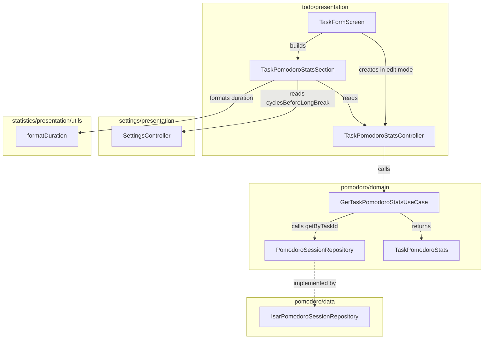

# Design Document: Task Pomodoro Statistics

## Overview

This feature adds a read-only Pomodoro activity summary to the task edit screen. A new use case (`GetTaskPomodoroStatsUseCase`) in the pomodoro feature aggregates session data into an immutable `TaskPomodoroStats` value object. A dedicated `TaskPomodoroStatsController` in the todo presentation layer manages async state (loading/loaded/error). A stateless `TaskPomodoroStatsSection` widget renders the metrics inside a Material 3 Card. The integration is conditional: it appears only in edit mode and does not interfere with task form functionality.

## Architecture



**Architectural boundaries:**

- The use case lives in `pomodoro/domain/use_cases/` because it queries pomodoro data and aggregates it. This keeps the pomodoro domain self-contained.
- The controller and widget live in `todo/presentation/` because they compose pomodoro data into the task editing UI. This is a presentation-layer composition — the todo *domain* has zero imports from pomodoro.
- No new Isar instance is created. The existing `IsarPomodoroSessionRepository` (already provided via `Provider<PomodoroSessionRepository>`) is reused.
- All operations are read-only. No persistence changes.

## Components and Interfaces

### TaskPomodoroStats (Entity)

**Location:** `lib/features/pomodoro/domain/entities/task_pomodoro_stats.dart`

An immutable value object holding aggregated Pomodoro metrics for a single task.

```dart
class TaskPomodoroStats {
  const TaskPomodoroStats({
    required this.completedPomodoros,
    required this.focusedDuration,
  });

  /// Number of completed Focus-mode sessions for the task.
  final int completedPomodoros;

  /// Total actual focused time across all completed sessions.
  final Duration focusedDuration;
}
```

### GetTaskPomodoroStatsUseCase

**Location:** `lib/features/pomodoro/domain/use_cases/get_task_pomodoro_stats_use_case.dart`

Fetches sessions for a given task ID via `PomodoroSessionRepository.getByTaskId` and aggregates them into a `TaskPomodoroStats`.

```dart
class GetTaskPomodoroStatsUseCase {
  const GetTaskPomodoroStatsUseCase(this._repository);

  final PomodoroSessionRepository _repository;

  Future<TaskPomodoroStats> call(int taskId) async {
    final sessions = await _repository.getByTaskId(taskId);

    final completedPomodoros = sessions.length;
    final totalSeconds = sessions.fold<int>(
      0,
      (sum, session) => sum + session.actualDurationSeconds,
    );

    return TaskPomodoroStats(
      completedPomodoros: completedPomodoros,
      focusedDuration: Duration(seconds: totalSeconds),
    );
  }
}
```

**Rationale:** `getByTaskId` already returns only completed Focus-mode sessions (only those are persisted in the MVP). No additional filtering is needed.

### TaskPomodoroStatsController

**Location:** `lib/features/todo/presentation/controllers/task_pomodoro_stats_controller.dart`

A `ChangeNotifier` managing the async lifecycle of fetching task Pomodoro stats. Holds loading/loaded/error state. Created per task-edit instance.

```dart
enum TaskPomodoroStatsStatus { loading, loaded, error }

class TaskPomodoroStatsController extends ChangeNotifier {
  TaskPomodoroStatsController({
    required GetTaskPomodoroStatsUseCase getTaskPomodoroStatsUseCase,
    required int taskId,
  });

  TaskPomodoroStatsStatus get status;
  TaskPomodoroStats? get stats;

  /// Fetches or refreshes the statistics.
  Future<void> load();
}
```

**State transitions:**
- On construction: status = `loading`, triggers `load()`.
- On success: status = `loaded`, `stats` populated.
- On failure: status = `error`, `stats` remains null. Form is unaffected.
- On refresh (re-enter screen): calls `load()` again.

### TaskPomodoroStatsSection (Widget)

**Location:** `lib/features/todo/presentation/widgets/task_pomodoro_stats_section.dart`

A stateless widget that receives the controller's state and settings, then renders the stats Card. It calculates equivalent cycles at build time: `completedPomodoros ~/ cyclesBeforeLongBreak`.

```dart
class TaskPomodoroStatsSection extends StatelessWidget {
  const TaskPomodoroStatsSection({
    super.key,
    required this.status,
    required this.stats,
    required this.cyclesBeforeLongBreak,
    required this.l10n,
  });

  final TaskPomodoroStatsStatus status;
  final TaskPomodoroStats? stats;
  final int cyclesBeforeLongBreak;
  final AppLocalizations l10n;

  @override
  Widget build(BuildContext context) {
    // Renders loading indicator, error fallback, empty state,
    // or the three-metric Card based on status and stats values.
  }
}
```

**Layout:** Uses `Wrap` for metric items to handle narrow screens (360dp). Each metric is a small column (icon + value + label) with Semantics labels.

### Integration in TaskFormScreen

When `_isEditMode` is true:
1. Create a `TaskPomodoroStatsController` (via `ChangeNotifierProvider`) scoped to this screen.
2. On screen focus return (via `RouteAware` or `didChangeDependencies` with `ModalRoute.of`), call `controller.load()` to refresh.
3. Insert `TaskPomodoroStatsSection` below the form fields, above the submit button.

### Dependency Injection

The `GetTaskPomodoroStatsUseCase` is registered at app level via Provider, consuming the already-provided `PomodoroSessionRepository`:

```dart
Provider<GetTaskPomodoroStatsUseCase>(
  create: (context) => GetTaskPomodoroStatsUseCase(
    context.read<PomodoroSessionRepository>(),
  ),
),
```

The `TaskPomodoroStatsController` is created locally in `TaskFormScreen` when in edit mode, injected with the use case and the task ID.

### Localization

New ARB keys added to `app_es.arb` and `app_en.arb`:

| Key | Spanish | English |
|-----|---------|---------|
| `taskPomodoroActivity` | Actividad Pomodoro | Pomodoro activity |
| `taskCompletedPomodoros` | Pomodoros | Pomodoros |
| `taskEquivalentCycles` | Ciclos equivalentes | Equivalent cycles |
| `taskFocusedTime` | Tiempo enfocado | Focused time |
| `taskNoPomodoroActivity` | Todavía no hay actividad Pomodoro para esta tarea | There is no Pomodoro activity for this task yet |
| `taskPomodoroCount` | `{count, plural, one{1 pomodoro} other{{count} pomodoros}}` | `{count, plural, one{1 pomodoro} other{{count} pomodoros}}` |
| `taskEquivalentCycleCount` | `{count, plural, one{1 ciclo} other{{count} ciclos}}` | `{count, plural, one{1 cycle} other{{count} cycles}}` |

### Duration Formatting

Reuses `formatDuration(int totalSeconds, AppLocalizations l10n)` from `statistics/presentation/utils/duration_formatter.dart`. The widget passes `stats.focusedDuration.inSeconds` and the current `l10n`.

## Data Models

No new Isar collections or persistence changes. The feature is entirely read-only, querying existing `PomodoroSessionModel` records via the indexed `taskId` field.

**Domain result object:**

```dart
class TaskPomodoroStats {
  const TaskPomodoroStats({
    required this.completedPomodoros,
    required this.focusedDuration,
  });

  final int completedPomodoros;
  final Duration focusedDuration;
}
```

**Derived at render time (not persisted):**
- `equivalentCycles = completedPomodoros ~/ cyclesBeforeLongBreak`

## Correctness Properties

*A property is a characteristic or behavior that should hold true across all valid executions of a system — essentially, a formal statement about what the system should do. Properties serve as the bridge between human-readable specifications and machine-verifiable correctness guarantees.*

### Property 1: Session count correctness

*For any* task ID and any list of PomodoroSession records returned by `getByTaskId(taskId)`, the `completedPomodoros` field of the resulting `TaskPomodoroStats` SHALL equal the length of that list.

**Validates: Requirements 1.1**

### Property 2: Duration summation correctness

*For any* task ID and any list of PomodoroSession records returned by `getByTaskId(taskId)`, the `focusedDuration.inSeconds` field of the resulting `TaskPomodoroStats` SHALL equal the sum of `actualDurationSeconds` across all sessions in that list.

**Validates: Requirements 1.2**

### Property 3: Equivalent cycles integer division

*For any* `completedPomodoros >= 0` and `cyclesBeforeLongBreak` in `[1..6]`, the equivalent cycles value SHALL equal `completedPomodoros ~/ cyclesBeforeLongBreak`.

**Validates: Requirements 2.1**

### Property 4: Empty session list yields zero stats

*For any* task ID where `getByTaskId(taskId)` returns an empty list, the resulting `TaskPomodoroStats` SHALL have `completedPomodoros == 0` and `focusedDuration == Duration.zero`.

**Validates: Requirements 1.4**

**Property Reflection:**

- Property 4 is technically subsumed by Properties 1 and 2 (when the list is empty, count=0 and sum=0). However, it is retained as a distinct property because it validates a specific edge case (the zero/empty boundary) that is important for UI behavior (triggers the empty-state message). It also serves as a sanity check that the aggregation handles the empty case without errors.
- Properties 1 and 2 are distinct because they test different aggregation dimensions (count vs. sum) and are independently falsifiable.
- Property 3 is independent from 1/2 as it tests presentation-layer arithmetic, not domain aggregation.

## Error Handling

| Scenario | Behavior |
|----------|----------|
| `getByTaskId` throws `PersistenceException` | Controller transitions to `error` state. Widget shows non-blocking fallback text. Form remains fully functional. |
| Unexpected exception during load | Same as above — caught generically, error state set. |
| Stats section in error state | Displays a short localized message (e.g., "No se pudieron cargar las estadísticas"). No retry button in v1.0 — stats refresh automatically on next screen focus. |
| Task form submission with stats in error | Submission proceeds normally. Stats failure never blocks task editing. |

**Design decision:** The stats controller catches all exceptions and never rethrows. The task form's own error handling remains completely independent.

## Testing Strategy

### Unit Tests

- **GetTaskPomodoroStatsUseCase**: Verify aggregation logic with mock repository returning known session lists. Cover: empty list, single session, multiple sessions with varying durations.
- **TaskPomodoroStatsController**: Verify state transitions (loading → loaded, loading → error). Verify `load()` calls the use case with correct task ID. Verify refresh re-fetches.
- **Equivalent cycles calculation**: Verify integer division with boundary values (0 pomodoros, 1 cycle setting, max values).

### Property-Based Tests

Property-based testing is appropriate for this feature because the core logic involves pure aggregation functions (count and sum) with clear input/output behavior and a large input space (arbitrary session lists and settings values).

**Library:** `fast_check` (Dart property-based testing library)

**Configuration:** Minimum 100 iterations per property test.

**Tag format:** `Feature: task-pomodoro-statistics, Property {number}: {property_text}`

Each correctness property (1–4) maps to a single property-based test:

1. **Property 1 test:** Generate random lists of `PomodoroSession` (0–100 items, random `actualDurationSeconds` 1–7200), pass to the use case with a mock repository, assert `completedPomodoros == sessions.length`.
2. **Property 2 test:** Same generated sessions, assert `focusedDuration.inSeconds == sum(actualDurationSeconds)`.
3. **Property 3 test:** Generate random `completedPomodoros` (0–10000) and `cyclesBeforeLongBreak` (1–6), assert `equivalentCycles == completedPomodoros ~/ cyclesBeforeLongBreak`.
4. **Property 4 test:** Generate random task IDs, mock repository returns empty list, assert zero stats.

### Widget Tests

- `TaskPomodoroStatsSection` renders correctly with loaded stats (three metrics visible).
- `TaskPomodoroStatsSection` shows empty-state message when stats are zero.
- `TaskPomodoroStatsSection` shows loading indicator when status is loading.
- `TaskPomodoroStatsSection` shows fallback on error state.
- `TaskFormScreen` in edit mode includes the stats section.
- `TaskFormScreen` in create mode does not include the stats section.
- Form remains functional when stats are in error state.
- Semantics labels are present for accessibility.
